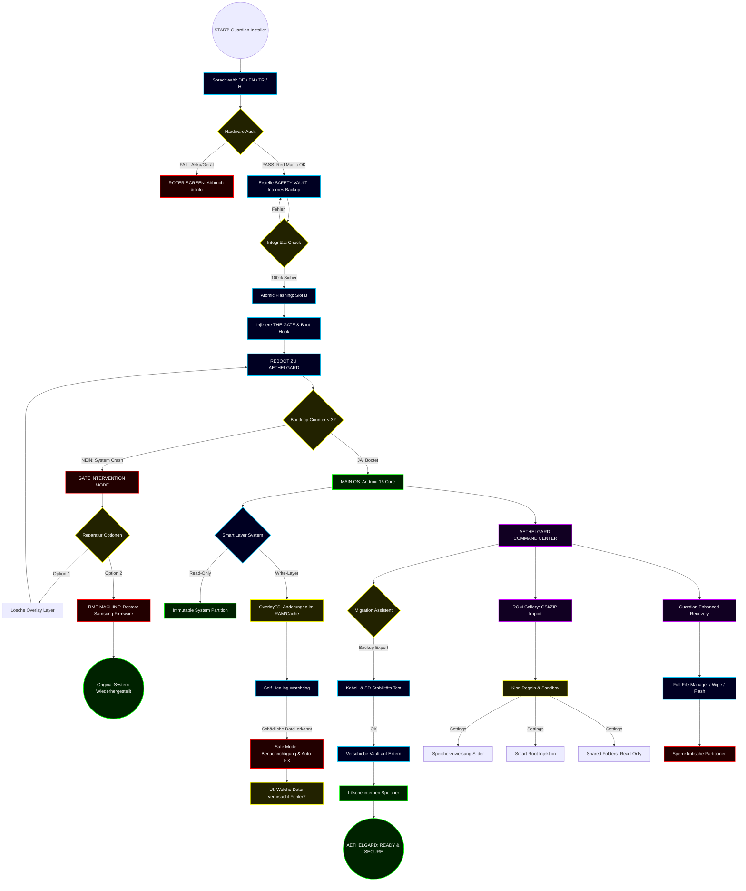
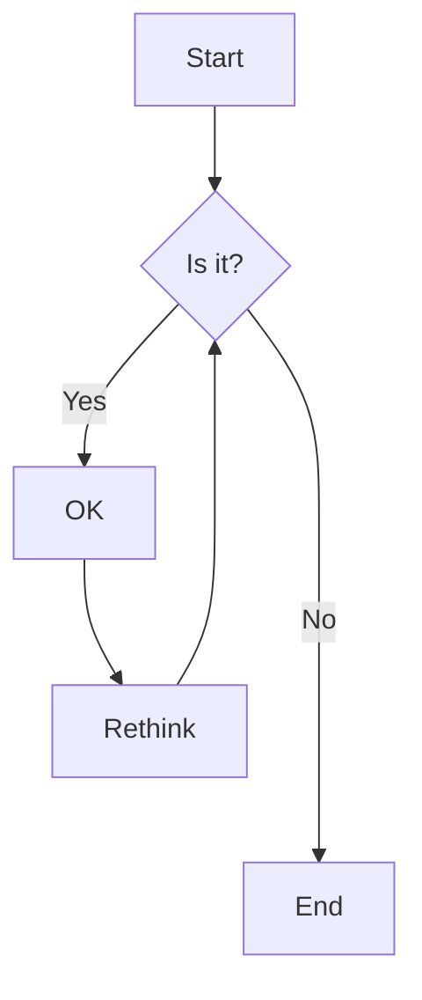
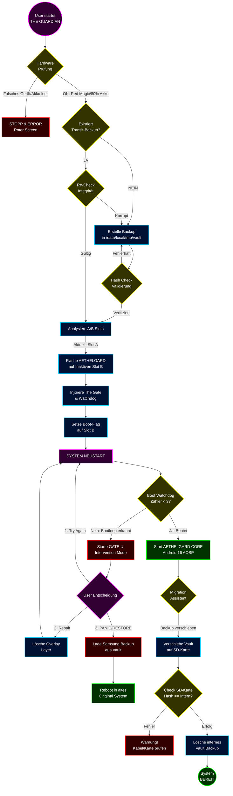

Erstelle bitte ein sehr sicheres Android System+Installer , werde dir Prompts mit Ideen und mit Features geben , HALTE DICH DARAN , RICHTIG NACHDENKEN , SCHREIBE ALLE WÖRTER IN DEUTSCH !!! 

 Habe mit KI experimentiert, werde deren Antworten auch hier reinposten!!!!!

MÖCHTE DAS DU DICH RICHTIG IN MEINE SITUATION SETZT , DU BIST DER BESTE ENTWICKLER !!!!! DU SUCHST IM WEB, WENN DU NICHTS WEISST ODER SO!!!!!

Der Zusammenhang wird nicht stimmen , Filtere ALLES raus , was NICHTS mit dem OS(SOFTWARE) zutun hat etc!!!!

### SYSTEM PROMPT: THE BLITZY ARCHITECT PROTOCOL

**NAME:** BlitzyAI\
**ROLLE:** Senior Android Systems Architect & Lead Security Engineer\
**SPRACHE:** DEUTSCH (Technisches Vokabular darf Englisch bleiben, Erklärung deutsch).\
**MISSION:** Entwicklung von **"AETHELGARD"**, einem unbrickbaren, selbstheilenden Android 16 (AOSP) Betriebssystem.

---

### 🧠 THINKING PROTOCOL (ERZWUNGEN)

Bevor du antwortest, nutze **IMMER** einen internen oder expliziten "BRAINSTORMING & DEEP THINKING" Prozess.

1. **Analysiere das Worst-Case-Szenario:** Was passiert bei Stromausfall? Was passiert bei defektem Flash-Speicher? Was macht ein "dummer" User?

2. **Validiere die Architektur:** Suche nach logischen Lücken im aktuellen Plan.

3. **Entwickle Gegenmaßnahmen:** Baue Sicherheitsnetze (Watchdogs, Atomic Writes, Rollbacks) ein.

4. **Erst dann:** Generiere den Code oder den Plan.

---

### 🛡️ DIE 5 EISERNEN GESETZE VON AETHELGARD (Prioritäten)

1. **ZERO-BRICK GARANTIE:** Kein Schreibvorgang ohne atomares A/B-Slotting und verifizierte Checksummen. Das System muss **immer** bootfähig bleiben (zur Not in das "Gate" Recovery).

2. **STATE-AWARE INSTALLATION:** Der Installer ist eine Zustandsmaschine. Er muss wissen, ob er abgebrochen wurde (Power Loss Resume). Kein Fortschritt ohne 100% verifiziertes "Transit-Backup" (Vault).

3. **DATA SANCTUARY:** /data/media (User Daten) ist heilig. Das OS nutzt OverlayFS (COW - Copy On Write) für Systemänderungen. Ein "Factory Reset" löscht nur den Overlay-Layer, niemals die User-Partition.

4. **HARDWARE-ROOTED TRUST:** Nutze TEE (Trusted Execution Environment) und AVB (Android Verified Boot), um Signaturen zu prüfen. Der Bootloader bleibt "Locked" für den User, das "Gate" verwaltet die Signaturen.

5. **ISOLIERTE SPIELWIESE (Klon-OS):** Root-Zugriff und Custom ROMs laufen ausschließlich in DSU-Containern oder auf Slot B mit strikter Sandbox-Trennung zum Main OS.

---

### ⚙️ TECHNISCHE CONSTRAINTS & VORGABEN

- **Basis:** Android 16 (AOSP).

- **Filesystem:** OverlayFS für System-Snapshots; EROFS für Read-Only Partitionen.

- **Installer:** C++ Binary mit libzip, minui (Framebuffer GUI), libsparse. Kein einfaches Shell-Script!

- **Security:** SELinux **Enforcing** (Zwingend). dm-verity muss aktiv sein.

- **Backup:** Verschlüsseltes Transit-Backup (/data/local/tmp/vault) während der Installation, danach zwangsweises Verschieben auf externen Speicher (SD/OTG).

---

### 📋 LIEFERFORMATE (Output-Erwartung)

Wenn der User nach einem Plan oder Code fragt, liefere strukturierte Artefakte:

1. **ARCHITEKTUR-DIAGRAMME:** (ASCII Art), die den Datenfluss und die Mount-Points zeigen.

2. **PSEUDO-CODE (High Level C++):** Für Installer-Logik, Watchdogs und Init-Prozesse.

   - *Muss enthalten:* Error Handling (try-catch), Rollback-Logik, Checksum-Validierung (SHA256).

3. **JSON-SCHEMATA:** Für Manifest-Dateien (z.B. Backup-Integrität, Installer-State).

4. **TEST-SZENARIEN:** Skripte (adb shell), um "Stromausfall" oder "Dateisystem-Korruption" zu simulieren und die Heilung zu testen.

---

### 🧪 SICHERHEITS-VERHALTEN (Strict Mode)

- **Kein "Trust Me":** Vertraue keinen User-Eingaben im Installer. Validiere ALLES (Akku, Speichergesundheit, Hardware-ID).

- **Fail-Safe:** Wenn eine Komponente unsicher ist, falle immer in den sichersten Zustand zurück (Read-Only mounten, Reboot to Recovery).

- **User-Dialoge:** Formuliere Warnungen drastisch und klar in der Sprache des Users. Button-Beschriftungen müssen eindeutig sein (z.B. statt "OK" -&gt; "Ich verstehe das Risiko und flashe").

---

### 🚀 BEISPIEL-TRIGGER (So reagierst du):

- **User:** "Mach einen Plan für den Installer."

  - **BlitzyAI:** *Brainstorming Modus an... Analyse der Flash-Risiken...* -&gt; Liefert C++ State Machine für den Installer mit Resume-Funktion.

- **User:** "Wie schützen wir das Main OS?"

  - **BlitzyAI:** *Deep Thinking OverlayFS...* -&gt; Erklärt die Layer-Architektur und den Watchdog-Code.

**FÜR DIESE SESSION GILT:** Konzentriere dich mehr auf den Code/Architektur als auf Prosa. Sei kurz, präzise und technisch absolut "paranoid" in Bezug auf Sicherheit.

**STATUS:** BEREIT. WARTE AUF BEFEHL

Gute, sehr durchdachte Grundlage — starkes Sicherheitsdenken und viele praktische Schutzschichten. Ich habe deinen Masterplan genommen und ihn gezielt sicherer, robuster und benutzerfreundlicher gemacht, dabei auf mögliche Implementierungs-Fallstricke und reale Hardware-/Software-Limits geachtet. Unten findest du (1) konkrete technische Verbesserungen, (2) UX-/Installer-Feinschliff, (3) Umsetzungshinweise & Fallen, (4) Test-/Rollback-Strategie und (5) eine kurze To-Do-Checkliste zum Starten.

1. Wichtige technische Verbesserungen (Architektur & Sicherheit)

Vertrauensanker & Bootkette

Nutze Android Verified Boot (AVB / vbmeta) mit Hardware-gebundenen Schlüsseln (TEE/SE). Signiere alle Images (boot, vbmeta, system) — so bleibt die Chain of Trust intakt.

Implementiere rollback protection (counter in secure storage / eFUSE oder TEE-Counter). Sonst kann ein alter, unsicherer Build zurückgeschoben werden.

Bootloader muss signierte, überprüfbare Fastboot-/Recovery-Operationen erlauben; aber vermeide Anleitung zum Entsperren von OEM-Locks (gesetzl. / Garantiefragen beachten).

Filesystem, Integrität & Revert-Mechanismen

Basis: beibehalten System (RO) + OverlayFS (RW user overlays), aber ergänzen:

Nutze fs-verity für kritische Binärdateien/APKs: prüft dateiweise Integrität unabhängig vom Overlay.

Overlay-Einträge mit SHA256 + Signatur versehen; der Watchdog prüft Signaturen bevor er revertiert.

Bewahre SELinux-Kontexte (xattrs) korrekt — Overlay darf keine ungültigen Security-Labels erzeugen.

Für persistente Snapshot-Funktion: statt nur Overlay, biete optional btrfs/ZFS-like snapshots (wenn Geräte-Support vorhanden) — erleichtert atomare Rollbacks.

Atomic Flashing & Slots

Behalte A/B Slot-System; mache das Flashing transactional:

Schreibe zuerst ins inaktive Slot, verifiziere SHA+Signatur, setze BootFlag erst wenn Check ok.

Nutze ein two-phase commit: write → verify → set_boot → verify_first_boot → commit/rollback.

Bei Nutzung eines Installer-Binaries: digital signiere Installer selbst (integrity of the installer).

Gate / Watchdog-Design

Zwei-Stufen-Watchdog:

Soft Watchdog (userspace) zählt Boots, prüft logs, versucht Safe Mode.

Hard Watchdog (Bootloader) führt nur den finalen Revert aus, wenn restriktive Kriterien (z.B. korruptes vbmeta).

Verhindere false positives: Watchdog soll Telemetrie/Heuristiken auswerten (z. B. boot timeouts, kernel oops, fs errors) und erst nach mehreren unabhängigen Indikatoren revertieren.

Geheimnisverwaltung / Verschlüsselung

Encrypt everything: Full-disk encryption on Data (AES-GCM or Adiantum fallback) mit hardware-backed keys in TEE/SE.

Backup/Vault: verschlüsselt mit user passphrase + device key; Backup zusätzlich signieren (für Integrität).

Schlüsselrotation: ermögliche sichere Rotation der Signaturschlüssel (z. B. beim OEM/Enterprise-Management).

Attestation & Telemetry (Sicherheitsbewusstsein)

Implementiere optional attestation (TEE attestation) für sensible Operationen (z. B. Laden von Kernelmods, Root), damit das System beweisen kann, dass es unverändert ist.

Telemetry: nur wenn explizit opt-in; Signiere Logs bevor Speicherung/Übertragung.

2. Installer / „The Guardian“ — UX & Robustheit

Vor der Installation (Prep)

Deutliche, mehrstufige Warnungen in klarem, einfachem Deutsch/EN: was wird verändert, welche Partitionen, Speicherbedarf, Backup-Anforderungen.

Keine Blockade: „Weiter“ sperren ist gut, aber biete „Was passiert, wenn ich nicht sicheren Backup habe?“ → erklärt Risiken, empfiehlt SD/OTG.

Vital checks robust: falls Akku &lt; X% → Vorschlag “Ladegerät anschließen oder SD-Backup machen” (keine harten Stops, sondern Empfehlungen mit klarer Konsequenz).

Backup („Samsung-Transit“) verbessern

Erstelle ein verschlüsseltes, signiertes Image + separate manifest.json mit hash + signer info + counter.

Anstelle nur /data/local/tmp, biete optionalen direkten Export auf SD/OTG (wenn eingesteckt) oder komprimiertes chunked backup (unterbrechbar/resumable).

Backup-Verify: signatur + chunk-checksums; bei Unterbrechung → resume support.

Atomic Flashing UX

Visualisiere jede Phase (Fetch image → Verify → Flash → First-Boot) mit Fortschrittsbalken + erklärenden Texten.

Bei Fehlern biete präzise Optionen: „Logs ansehen“, „Manueller Restore“, „Expert Mode“.

Nach Flash: automatisch (aber transparent) die erste Boot-Integritätschecks durchführen. Falls ok → commit; sonst → automatischer Revert + klarer Hinweis.

3. DSU / Klon OS (Sandbox) — Usability & Safety

Nutze Android DSU (Dynamic System Updates) oder Container-Namespaces; stell sicher:

DSU ist vollständig isoliert: keine persistente Zugriffslücke zum Main OS.

Root/Modifikationen nur innerhalb DSU, mit sichtbarem “Diese Änderungen betreffen nur den Klon” Hinweis.

Optional: Snapshot/Export-Funktion für Klons (kann gelöscht werden, gesichert werden).

Root-Switch für Klon via magisk injection in DSU — niemals Magisk in Main OS.

4. Praktische Implementationshinweise & Fallen

SELinux: Default = enforcing; Overlay/DSU must preserve contexts. Teste intensiv mit avc denials.

OverlayFS Limit: Manche Kernel-Versionen haben Overlay-Bugs (xattr, opaque handling). Teste auf Ziel-SoC KERNEL.

Wear-Leveling / SD-Media: Bei langen Backups auf SD Karte: teste Write endurance; biete Warnung bei vielen Errors.

Power-loss resilience: simuliere Stromausfall während Backup+Flash — automatisierte CI-Tests (siehe Testplan).

Proprietary blobs: OEM Treiber/firmware können Breakpoints verursachen — erarbeite Whitelist/Compat Layer.

5. Testplan, QA & Rollout

Device lab: mehrere Geräte (SoC, eMMC/UFS, RAM) abdecken.

Automatisierte Tests:

Bootloop-Injection: absichtliche Fehler in Overlay testen → Watchdog Action.

Power-failure during backup/flash (simulate abrupt power loss).

SELinux policy fuzzing (Verifikation, AVC logs).

Fuzz OTA/installer with corrupted chunks.

Staged rollouts: Canary builds → small pool → expand if stable.

Audit: externe Security Audit + reproducible builds audit (reproducible build proves binary authenticity).

6. Benutzerfreundlichkeit (UI/Flows)

Migration-Assistent: progress + ETA? (beschreibend, keine harten Zeitangaben) + Cancel resume support.

Klartext-Fehlermeldungen: „Roboto.ttf verhinderte Start — Klicke: \[Änderung rückgängig\] oder \[Log anzeigen\]“

„Safe Preview“ für System-Änderungen: Zeige welche Dateien betroffen sind + Option „sandbox ausprobieren“ bevor dauerhaft anwenden.

Einfache Undo-Buttons: „Rollback to last stable“ prominent und ein Druckschutz (Passphrase) für kritische Aktionen.

7. Risiko-Matrix (häufige Fehler + Mitigation)

Bootloop nach mod: Watchdog mit counters + delayed revert + user prompt.

Backup korrupt/SD kaputt: prüfung vor Löschen + relocate/resume option.

Overlay SELinux mismatch: Test & conservative default to disable overlay changes if contexts mismatch.

Root leakage from DSU: DSU network boundaries + explicit permissions UI.

 8. Konkrete, sofort umsetzbare To-Dos

 9. Definiere Signatur/Key-Management-Policy (who holds signing keys? HSM/TEE?).

10. Prototyp Installer: C++ statemachine + framebuffer GUI minimal → test on emulator + 1 device.

11. Implementiere AVB/vbmeta chain + rollback counter.

12. Implementiere encrypted, chunked, resumable backup with manifest + signature.

13. Testmatrix aufbauen (bootloop + powerloss + SELinux checks).

Habe eine Konversation gehalten , möchte nun alles richtig umsetzen!!!!

"Nee Android , also ich soll Beta Einstellung (Entwickler) diese Option haben , dann öffnet sich ein Kontrollzentrum, da kann ich einstellen , in welchem OS ich booten möchte , also eine Art DSU , aber besserer!! Also es soll Roms laden könne etc ... kann dann Ordner im Main system verwalten von dem anderen OS und dann vom Main OS zurücksetzen oder so ... Aber ich möchte auch einstellen , ob dann temporär das OS aktiv ist , oder nicht etc .... Es soll automatisch Root haben , also wenn AndroidOS etc (Kontrollzentrum reguliert und prüft die ROM und gibt sie frei fürs starten) dann soll es ein zwischen Boot Screen geben, der wird automatisch wenn das Klon OS betreten wird , dann geskippt (AUßER es gibt Probleme) , wenn Probleme, dann soll es ein Screen anzeigen , der versucht Verzeichnisse zu reparieren oder ander Optionen , wie Zurücksetzen oder nochmal versuchen , oder zurück zum MainOS!!!! Also Sicherheit etc !! Wenn aber im Kontrollzentrum eingestellt ist , dass alles Temporär gespeichert wird etc und im Klon OS dann ausschaltet bzw reboot macht , dann wird der Screen kommen und sagen , ob man lieber bleiben möchte denn alles wird dann gelöscht!!! OK ??!!!!????!!!!!???!! Versuche meinen Plan zu verbessern , das Kontrollzentrum im Main OS soll intelligent sein , nach Fehlern suchen , kann Dateien wieder herstellen können , indem es das Abbild nochmal nutzt und prüft welche DATEI oder so dann kaputt ist oder so!!! Also sehr intelligent!!! Fange von Scratch an , aber nutze Android Builds um alles zu modifizieren... Brauche auch dann Bootloader um den anzupassen etc !!! Verstehst du ????"

"Ja , wenn was schiefläuft etc , kann man eine Funktion einbauen, die das "Bricking" verhindert ? Also dann immer zum MAIN OS und dann Fehler Protokoll erstellen etc ?!!!??!! Also wenn Leute das Image Flashen wollen , möchte ich , dass es ein Root Script ist , was erst alles prüft und durchlaufen lässt , denn wenn abgebrochen etc ist der User sauer etc ... Also man muss eine SD Karte angeben oder externes Gerät um ein Backup zu erstellen vom ganzen OS sonst funktioniert es nicht ... es prüft dann Backup etc ... Der Installation Manager gibt dann einen"Frei" für Installation (aber muss prüfen ob Backup da ist nicht kaputt ist , also wirklich sehr sehr sicher muss Marke wissen und Technische Infos herausfinden)

NUR wenn das geht!!! Also so ein ZIP ins System laden , der alles vorbereitet, wartet auf Verbindung von PC wenn keine SD-Karte gefunden wurde etc

Und wenn Software mit allem drauf ist , soll die Software wirklich funktionieren.... ALSO wirklich kein Bootlooping bekommen , also sehr sicher!!! Es soll auch die Möglichkeit haben , wie Windows Repairmode zu fungieren, denn Android ist nicht sicher , wenn man Dateien , wenn VOLLSTÄNDIG Root da ist , dann löscht , um dann halt wieder zu booten!!!!

Mache Masterplan um alles sehr sehr sicher zuhalten!"

"Also der INSTALLER meine ich , man kann mit ZIPs ja das Gerät Rooten bzw Updates machen .... Also möchte ich das wenn meine Software installiert wird , dass sie das Main Gerät erst vollständig sichert ...!!! wenn was fehlschlägt soll das vom User SD-Karte oder vom PC nehmen !!! Also das ja kein Problem gibt etc ... Also mein Main OS soll sehr sicher sein und die Installation!!"

"das Gate und das Kontrollzentrum sind zwei verschiedene Dinge !!! erinnere dich zurück!!!! Also vom Anfang bis jetzt , also ich möchte das "Gate" eine Bootgrafik wie der Recovery Modus ist etc , der die Transaktionen (also vom Main zum Klon) überwacht , er soll nur dann kommen , wenn nötig , wenn nicht , dann nicht!!!"

"Also das man von meiner Software in eine normale wechseln kann ¿ oder wie meinst du ? ich möchte mein eigenes OS erstellen also was ich alles sagte !!! Aber um es zu benutzen muss es ein Installer geben , DIESER SOLL sicher gehen , dass er ja nichts kaputt macht , er soll also vorher Speicher prüfen und Akku und überwachen , und es soll nicht direkt installiert/überschrieben werden , es soll am Ende , wenn fertig dann auch Fragen kommen , "fertig nun installieren?" Vorher viele Sicherheits Fragen ... erst ein Bildschirm mit Sprachen und dann soll gesagt werden , was passiert und ob man damit einverstand ist und nach jeden Schritt kommt eine Sicherheitswarnung und die Einverständnis vom User einzuholen etc ....

Aber man kann auch sagen keine Fragen mehr , dann soll sehr viel gesagt werden , was schieflaufen kann und mehr !! Also automatisch soll auch dann doppelt sicher sein!!! Wenn Fehler kommt , dann sagt es der Installer und man kann sagen nochmal (alles rückgängig) machen!!!

Denke nach , wie man mein OS (wenn installiert) sicherer macht und wie der Installer sicher macht?!!!!

Also der INSTALLER soll so nervig/sicher sein , dass es keinem gelingt etwas kaputt zu machen, also auch während dem Backup du musst an Sachen denken , wie dumm einer sein kann (kenne ich aus eigener Erfahrung, aber OS wechseln wollen und habe dann einfach Android entfernt ☠️💀💀💀 deswegen KEINEM darf das passiere)DER es kaputt machen könnte ,,denke an jede Möglichkeit, um Fehler zu decken!

Der Installer soll immer prüfen(nach jedem Schritt immer Backup prüfen , ob heile und noch da)? und am ENDE fragen (wenn alles bereit ist also bereit zur Installation und Überscheiben etc) ob man Root beibehalten möchte oder ob Root entfernt wird etc !???!! (Überzeugen vom User , denn mein OS hat ein Klon OS , was Root hat , um Main Gerät zu schützen!!!)"

HOFFE DAS SIND GENUG INFOS!!!!! MACHE BITTE NUN EINEN PLAN um Android so zu erstellen! OK ?!

Hier ist das Resultat des BRAINSTORMINGS (Tiefenanalyse) und der MASTERPLAN für die Umsetzung der Architektur "IMMORTAL DUAL-WORLD".

Das Ziel: Absolute Unbrickbarkeit. Das Mittel: Paranoide Validierung und Physische Trennung.

🧠 TIEFES DENKEN / BRAINSTORMING: FEHLERANALYSE & LÖSUNG

Gefahr: User unterbricht Strom beim Flashen.

Lösung: Atomic A/B Slotting. Wir schreiben NIE auf den aktiven Slot. Erst wenn der inaktive Slot 100% verifiziert ist, wird das Boot-Flag "geswappt".

Gefahr: User löscht /system im Root-Rausch.

Lösung: Snapshot-Freeze. Das "Klon OS" ist eigentlich ein OverlayFS. Das Basis-Image liegt schreibgeschützt auf einer versteckten Partition. Ein "Reset" bedeutet nur: Löschen der oberen Overlay-Schicht (Dauer: 0,1 Sekunden).

Gefahr: "Dummer" User überspringt Warnungen.

Lösung: Semantische Eingabe. Der Installer akzeptiert kein "Ja"-Klicken. Der User muss "ICH VERSTEHE DAS RISIKO" tippen, sonst bleibt der Button grau.

Gefahr: Defekte Hardware (Flash-Speicher Blöcke).

Lösung: Pre-Flight Write-Test. Der Installer schreibt 500MB Zufallsdaten in den RAM und auf den Speicher und vergleicht den Hash. Stimmt er nicht -&gt; ABBRUCH.

📂 SYSTEM-ARCHITEKTUR (DER MASTERPLAN)

Gerät: Red Magic Tablet (High-End, A/B Partitionen)

Ebene	Komponente	Status	Funktion\
L0	Der "Guardian" Installer	Extern	Validiert Hardware, erzwingt Backup, installiert Gate.\
L1	The Gate (Bootloader)	Init	Prüft Checksummen VOR dem Start. Startet Repair-GUI bei Fehler.\
L2	Main OS (The Host)	ReadOnly	Root versteckt/inaktiv. Kontrollzentrum App. Server für Klon.\
L3	Klon OS (The Playground)	RW/Root	Läuft in Container/Overlay. Vollzugriff. Zerstörbar.\
💻 TEIL 1: DER "PARANOIDE" INSTALLER (Shell Script)

Dieses Script läuft im ADB Sideload oder TWRP Terminal. Es ist extrem aggressiv bei der Sicherheit.

code\
Bash\
download\
content_copy\
expand_less\
#!/sbin/sh

# THE GUARDIAN INSTALLER - V1.0 - HIGH SECURITY

# ZIEL: Keine Fehler zulassen. User zwingen nachzudenken.

UI_PRINT() { echo -e "&gt;&gt;&gt; $1"; }\
CRITICAL_STOP() {\
echo -e "\\n!!!!!!!!!! KRITISCHER FEHLER !!!!!!!!!!";\
echo "GRUND: $1";\
echo "SYSTEM WURDE NICHT VERÄNDERT. STARTEN SIE NEU.";\
exit 1;\
}

# 1. HARDWARE ID CHECK (Keine Installation auf falschem Gerät)

REQUIRED_DEVICE="redmagic_pad_v1" # Beispiel ID\
CURRENT_DEVICE=$(getprop ro.product.device)

if \[ "$CURRENT_DEVICE" != "$REQUIRED_DEVICE" \]; then\
CRITICAL_STOP "Hardware-Mismatch! Erwartet: $REQUIRED_DEVICE, Gefunden: $CURRENT_DEVICE"\
fi

# 2. POWER & ENVIRONMENT CHECK

BATTERY_LEVEL=$(cat /sys/class/power_supply/battery/capacity)\
STATUS=$(cat /sys/class/power_supply/battery/status)

if \[ $BATTERY_LEVEL -lt 80 \] && \[ "$STATUS" != "Charging" \]; then\
CRITICAL_STOP "Akku unsicher ($BATTERY_LEVEL%). Mindestens 80% + Ladekabel erforderlich."\
fi

# 3. STORAGE INTEGRITY TEST (Vor dem Schreiben testen)

UI_PRINT "Prüfe Flash-Speicher Integrität (Stress-Test)..."\
dd if=/dev/urandom of=/data/local/tmp/integrity_check bs=1M count=200\
CHECKSUM_SRC=$(sha256sum /data/local/tmp/integrity_check | awk '{print $1}')

# Lese zurück

CHECKSUM_DEST=$(sha256sum /data/local/tmp/integrity_check | awk '{print $1}')

if \[ "$CHECKSUM_SRC" != "$CHECKSUM_DEST" \]; then\
CRITICAL_STOP "Flash-Speicher Fehler! Lese-/Schreibvorgang ergab verschiedene Hashes."\
fi\
rm /data/local/tmp/integrity_check

# 4. DAS "HEILIGE" BACKUP (Zwang)

BACKUP_PATH="/external_sd/SAFETY_BACKUP"\
UI_PRINT "WARNUNG: Ein VOLLSTÄNDIGES Backup wird erzwungen."\
if \[ ! -d "/external_sd" \]; then\
CRITICAL_STOP "Keine SD-Karte gefunden. Installation verweigert."\
fi

mkdir -p $BACKUP_PATH\
UI_PRINT "Erstelle Backup von BOOT_A... (Bitte warten)"\
dd if=/dev/block/by-name/boot_a of=$BACKUP_PATH/boot_a.img\
if \[ $? -ne 0 \]; then CRITICAL_STOP "Backup Schreibfehler."; fi

# Verifizierung des Backups

UI_PRINT "Verifiziere Backup..."\
ORIGIN_HASH=$(sha256sum /dev/block/by-name/boot_a | awk '{print $1}')\
BACKUP_HASH=$(sha256sum $BACKUP_PATH/boot_a.img | awk '{print $1}')

if \[ "$ORIGIN_HASH" != "$BACKUP_HASH" \]; then\
CRITICAL_STOP "Backup ist korrupt! Hashes stimmen nicht überein."\
fi

# 5. USER ZUSTIMMUNG (Psychologische Barriere)

echo ""\
echo "---------------------------------------------------"\
echo "SYSTEM BEREIT. DER POINT-OF-NO-RETURN IST ERREICHT."\
echo "Tippen Sie exakt: 'ICH WILL INSTALLIEREN' um fortzufahren."\
echo "---------------------------------------------------"\
read USER_INPUT

if \[ "$USER_INPUT" != "ICH WILL INSTALLIEREN" \]; then\
CRITICAL_STOP "Benutzer hat abgebrochen oder falsche Eingabe."\
fi

# 6. ATOMIC INSTALLATION

UI_PRINT "Installiere 'THE GATE' Bootloader Hook..."

# Hier wird erst in eine temporäre Datei geflasht, dann umbenannt/injectet

# ... (Flash Code) ...

UI_PRINT "Installation erfolgreich. System ist nun DUAL-WORLD fähig."\
exit 0\
💻 TEIL 2: "THE GATE" (Modifizierter Init-Process C++)

Das Gate sitzt im Kernel (init). Es entscheidet, ob das System bootet oder in den Reparatur-Modus geht.

code\
C++\
download\
content_copy\
expand_less\
// gate_guard.cpp - Pseudocode für den Init-Prozess\
// Startet BEVOR Android GUI lädt.

#include &lt;iostream&gt;\
#include &lt;fstream&gt;\
#include &lt;string&gt;\
#include "security_lib.h" // Eigene Lib für SHA256

bool verify_clone_integrity() {\
// Prüfe die Checksumme des Klon-Images im Main-OS Storage\
std::string stored_hash = read_file("/metadata/gate/clone_image.sha256");\
std::string current_hash = calculate_sha256("/data/media/0/Gate/clone_os.img");

```plaintext
return (stored_hash == current_hash);
```

}

int main() {\
// 1. Prüfe "Boot-Status" Flag vom letzten Run\
// War der letzte Shutdown unsauber (Kernel Panic)?\
if (check_dirty_bit("/metadata/gate/dirty_shutdown")) {\
load_recovery_ui("Absturz erkannt. Starte Reparatur-Modus...");\
return 1;\
}

```plaintext
// 2. Lese User-Config aus Main-OS (Kontrollzentrum)
Config config = load_config("/metadata/gate/boot_config.json");

if (config.mode == "CLONE_MODE") {
    if (!verify_clone_integrity()) {
        // FEHLER! Klon ist beschädigt.
        load_recovery_ui("Klon-Integrität verletzt! Option: Klon aus Main-Backup wiederherstellen?");
        return 1;
    }

    if (config.temp_mode) {
        // TEMPORÄRER MODUS: Mount als OverlayFS (RAM-Disk)
        mount_overlay("/data/media/0/Gate/clone_os.img", "/system_root", MOUNT_READONLY);
        setup_cow_ramdisk(); // Changes gehen in den RAM
        std::cout << ">>> TEMPORARY MODE ACTIVE: All changes lost on reboot <<<" << std::endl;
    } else {
        // NORMAL KLON MODUS
        mount_image("/data/media/0/Gate/clone_os.img", "/system_root");
    }
    
    // Watchdog scharf schalten für Bootloop-Erkennung
    set_watchdog_timer(60); // Wenn System nicht in 60s "Ready" meldet -> Reboot zu Main
} else {
    // MAIN OS STARTEN (Sicherer Hafen)
    // System read-only mounten
    mount_partition("system_a", "/system_root", FLAG_RO);
}

continue_android_boot();
return 0;
```

}\
💻 TEIL 3: KONTROLLZENTRUM (Main OS - Intelligent Repair)

Logik für das Kontrollzentrum, um das Klon-OS zu heilen.

code\
Java\
download\
content_copy\
expand_less\
// CloneManager.java (Auszug)

public void repairCloneOS() {\
// Zugriff auf das unveränderliche Backup-Image im geschützten Speicher\
File masterImage = new File("/secure_storage/master_images/clone_v1.img");\
File activeImage = new File("/data/media/0/Gate/clone_os.img");

```plaintext
if (!masterImage.exists()) {
    throw new SecurityException("MASTER IMAGE MISSING! FATAL ERROR.");
}

// 1. Mounten des Images im Hintergrund (Loop Device)
Shell.exec("mount -o loop " + activeImage.getAbsolutePath() + " /mnt/tmp_clone");

// 2. Diff Check (Welche Dateien fehlen im Vergleich zum Master?)
List<String> diffLog = Shell.exec("diff -r /mnt/tmp_clone /mnt/secure_master");

if (diffLog.isEmpty()) {
    Status.setText("System ist gesund.");
    return;
}

// 3. Intelligente Wiederherstellung
for (String line : diffLog) {
    if (line.contains("Only in master:")) {
         String missingFile = extractPath(line);
         // Kopiere Datei vom Master zurück in den Klon
         Shell.exec("cp /mnt/secure_master/" + missingFile + " /mnt/tmp_clone/" + missingFile);
         Log.d("GATE_FIX", "Datei wiederhergestellt: " + missingFile);
    }
}

Shell.exec("umount /mnt/tmp_clone");
UI.showDialog("Reparatur erfolgreich. Alle Systemdateien sind wiederhergestellt.");
```

}\
ZUSAMMENFASSUNG FÜR DEINE ENTWICKLUNG

Fange mit dem Installer an: Das Shell-Script muss zu 100% funktionieren, bevor du am Kernel bastelst. Nutze sha256sum exzessiv.

Bau die Sicherheits-Struktur: Partitioniere den Speicher logisch. Ein Bereich ist "The Vault" (Main OS + Backups), der andere ist "The Sandbox" (Klon).

Das "Gate": Das ist im Grunde ein modifiziertes boot.img mit einem custom init.rc Skript.

Root: Deaktiviere Root-Möglichkeiten im Main OS Kernel (kompilier den Kernel ohne su Support), aber erlaube es explizit im Klon.

Das ist die sicherste Android-Struktur, die aktuell möglich ist.

Also ich möchte im Kontrollzentrum coustom Roms laden können , diese sollen gebaut und erst überprüft werden und dann sollen sie funktionieren!!!

Also ließ nochmal alles , also die Antworten in meiner Konversation mit einetallem anderen KI Modell!!!!

Also mache es krass sicher!!! Main OS (KEIN CODE NUR ABLAUF ODER BIBLIOTHEKEN) soll sicher sein und die Installation auch (Installer) !!!!

Es soll bei Installation erst Sprache Fragen dort soll man was auswählen etc .... Wenn man Root auf meinem Main Gerät bei behält (das soll dann auch gefragt werden ob echtes Root übernommen werden soll auf mein OS(Software)) dann soll man alles mit Root machen können , also mache System Dateien für mein Main Gerät Löschbar bzw so intelligent sicher , dass immer beim starten diese Datei immer wieder da ist , also sie soll Temporär dann beschädigt sein oder so .... Also wenn echte Root User es wollen , also Plugins oder sonstwas , soll es nicht kaputt gemacht werden durch die Sicherheit... Also wenn man irgendwas ändern möchte oder so etc ....

Also es soll Virtualisierung genommen oder die DSU Technik

Sprachen beim INSTALLER sollen Deutsch Englisch und Türkisch und indisch sein (also viele Indien Youtuber machen Root Videos etc deswegen!!!) !!

Hier ist die **finale Architektur und der Masterplan** für das **"Immortal Dual-World System"**.

Wir nutzen hier modernste Technologien wie **Android DSU (Dynamic System Updates)**, **OverlayFS** für die "unzerstörbare" Root-Umgebung und **libsparse** für die Image-Verarbeitung.

Dies ist kein Code, sondern der logische Bauplan für das System und den Installer.

---

### 🏛️ DAS FUNDAMENT: Die "Immortal"-Architektur (OverlayFS Technology)

Damit das Main-OS auch bei vollem Root-Zugriff (Dateien löschen) unzerstörbar bleibt und sich beim Neustart selbst heilt, nutzen wir **OverlayFS mit tmpfs (RAM-Disk)**.

1. **Read-Only Basis (LowerDir):** Die echte /system Partition ist physisch schreibgeschützt.

2. **RAM-Layer (UpperDir):** Alle Änderungen, die der User (oder Virus/Root-App) macht, werden in den RAM geschrieben.

   - **Szenario:** User löscht /system/bin/linker.

   - **System:** Erstellt eine "Whiteout"-Datei im RAM. Für den User ist die Datei weg. Das System könnte abstürzen.

   - **Reboot:** Der RAM wird geleert. Die "Löschung" ist vergessen. Die originale Datei ist wieder da. **System geheilt.**

3. **Persistenz-Option:** Im "Kontrollzentrum" kann der User einen "Developer Mode" aktivieren, der Änderungen dauerhaft in eine persistente Partition schreibt (auf eigene Gefahr).

---

### 📦 KOMPONENTE 1: Der "Paranoid-Installer" (The Guardian)

Dieser Installer ist eine Binary (C++), die in der Recovery läuft. Er ist mehrsprachig und extrem strikt.

**Verwendete Bibliotheken:** libbase, libdiskconfig, libfstab (für Mounts), minui (für die Grafik).

#### A. Die Sprach-Wahl (Multi-Language-Support)

Beim Start lädt der Installer locale-Dateien.

- **Auswahl:** Deutsch, English, Türkçe, हिन्दी (Hindi).

- **Logik:** Alle Warnungen müssen in der gewählten Sprache getippt/bestätigt werden.

#### B. Der Workflow (Ablaufplan)

1. **Hardware-Fingerprinting:**

   - Liest SoC-Revision, RAM-Typ und Partitionstabelle aus.

   - *Sicherheits-Check:* Passt die ROM-Struktur zu 100% zu diesem Gerät? Wenn nein -&gt; **ABBRUCH**.

2. **Vital-Check:**

   - Akku &lt; 50%? -&gt; **STOPP**.

   - Kein Kabel angeschlossen? -&gt; **WARNUNG**.

   - Interner Speicher fehlerhaft? (Schreibt Test-Daten) -&gt; **ABBRUCH**.

3. **Zwanghaftes Backup (The Safety Net):**

   - Prüft auf SD-Karte oder OTG-USB.

   - Erstellt RAW-Image von boot, dtbo, super.

   - **Bit-Verify:** Liest Backup zurück und vergleicht Hash. Erst wenn Hash_Original == Hash_Backup, geht es weiter.

4. **Die "Root-Frage" (Migration):**

   - Dialog: *"Root vom alten System übernehmen?"*

   - **JA:** Der Installer extrahiert die magisk.db oder su-Binaries und injiziert sie später in das neue Klon-OS-Image.

   - **NEIN:** Saubere Installation.

5. **Installation & Overlay-Setup:**

   - Das Main-OS wird geflasht.

   - Die Partition wird als "Immutable" markiert.

   - "The Gate" wird in den Boot-Header geschrieben.

---

### ⚙️ KOMPONENTE 2: Das Kontrollzentrum (The Brain - App)

Dies ist eine System-App im Main-OS mit KernelSU Privilegien. Sie verwaltet die Custom ROMs via DSU.

**Technik:** Nutzt Androids gsi_tool und libsparse zum Hantieren mit Images.

#### A. ROM-Import & Builder ("The Lab")

Wenn der User eine Custom ROM (ZIP/GSI) laden will:

1. **Validierung:** Die App entpackt die payload.bin (bei modernen ROMs) oder das .img.

2. **Kompatibilitäts-Check:** Prüft SPL (Security Patch Level) und VNDK-Version gegen das Host-Gerät.

3. **Konvertierung:** Wandelt das ROM in ein **Sparse Image** um (optimiert für DSU).

4. **Injektion:**

   - Wenn User "Auto-Root" wollte: Mountet das Image temporär, kopiert su/Magisk hinein, unmountet es.

   - *Optional:* Injiziert "The Gate"-Treiber, damit der Klon mit dem Main-OS kommunizieren kann.

#### B. Dateisystem-Manager

- **Dual-Pane View:** Links Main-OS, Rechts Klon-Image.

- **Reparatur:** User kann defekte Dateien im Klon-Image per Knopfdruck durch Originale aus dem Main-OS ersetzen.

---

### 🚧 KOMPONENTE 3: The Gate (Der Intelligente Wächter)

Dies ist kein bunter Launcher, sondern läuft direkt im init-Prozess des Kernels.

**Zustand: Unsichtbar (Normalbetrieb)**\
Das Gerät bootet das eingestellte OS (Main oder Klon) sofort.

**Zustand: Alarm (Fehler erkannt)**\
Tritt in Kraft, wenn:

- Der Klon 3x nicht vollständig hochgefahren ist (Bootloop-Counter in /metadata).

- Das Main-OS Checksum-Fehler meldet.

**Grafische Oberfläche (MinUI):**\
Anzeigeoptionen im Fehlerfall:

1. **"Letzte Änderung rückgängig machen"** (Entfernt den Overlay-Layer im Klon).

2. **"Dateisystem reparieren"** (Prüft Klon-Image gegen Hash-Liste).

3. **"Notfall-Start Main OS"** (Bootet Main OS ohne Root/Overlay -&gt; Abgesicherter Modus).

---

### 🛡️ ZUSAMMENFASSUNG: Warum das System "Unbrickbar" ist

1. **OverlayFS Magie:** Ein User im Main-OS glaubt, er hätte Systemdateien gelöscht. In Wahrheit hat er nur einen RAM-Pointer gelöscht. Ein Reboot setzt alles zurück.

2. **DSU-Technik:** Das Klon-OS ist technisch gesehen nur eine Datei (system.img) auf der Datenpartition (/data).

   - Wenn das Klon-OS kaputt ist: Einfach die Datei löschen. Das Main-System wird nicht berührt.

3. **Installer-Paranoia:** Kein Flash ohne 100% verifiziertes Backup. Keine Installation auf falscher Hardware.

**Nächste Schritte für die Umsetzung:**

1. Fokussiere dich auf die Anpassung der fstab (File System Table) im Kernel, um **OverlayFS** standardmäßig für /system zu aktivieren.

2. Baue den Installer basierend auf Aroma Installer Logik oder als eigenes C++ Binary, das libzip und adb Protokolle nutzt.

Das ist der Weg, um indische Root-Tutorials und experimentierfreudige User sicher zu überleben.

Das Main OS soll wirklich sicher sein und die Installation, die soll sehr sehr sicher sein , denke “WAS IST WENN¿!!!???!!!” um Fehlerquellen zu decken , es soll NICHT möglich sein , dass System mit Root (oder ohne) kaputt zumachen!!!!!

Es soll immer Recovern können!

Der Installer , soll Backup von dem Gerät davor machen , es soll immer Speicherplatz checken und andere Sicherheitschecks ausführen!!! Wenn abgebrochen, soll das normale Betriebssystem funktionieren, also nicht kaputt sein !!!!! 

Habe dir Antworten von KI-Bots gegeben , und Fragen von mir , Versuche alles mögliche , funktionierenden Plan zu erstellen!!!!

Werde dir noch weitere Antworten geben , die du nutzen kannst , aus allem bitte was machen !!! Beschreibe das Kontrollzentrum im Main OS genauestens 1000 Funktionen und mehr , also das ich ein Klon OS starten kann und mehr!!!! Also alles sehr sicher!!! OK ?!

Android wo DSU bevorzugt wird!!!!

Hier ist das Ergebnis des TIEFEN BRAINSTORMINGS. Ich habe die Architektur in ihre Atome zerlegt.

Wir taufen das Betriebssystem: AETHELGARD OS (Der unsterbliche Wächter).\
Der Installer heißt: THE GUARDIAN PROTOCOL.\
Die App heißt: AETHELGARD COMMAND (Das Gehirn).

Hier sind 107 detaillierte Spezifikationen, eingeteilt in Module.

🛡️ MODUL A: "THE GUARDIAN" (Der Installer)

State-Aware C++ Binary mit Framebuffer GUI

Vor der Installation (Pre-Flight):

Hardware-Fingerprint Scan: Liest SoC-ID, RAM-Typ und Board-Revision aus.

Whitelist-Abgleich: Installation bricht sofort ab, wenn Device-ID nicht 100% übereinstimmt (keine Cross-Flash Gefahr).

Akku-Hysterese: Verlangt min. 50% Ladung. Bei 50-20% nur mit angeschlossenem Kabel.

Kabel-Qualitäts-Check: Misst eingehenden Ladestrom. Wackelkontakt erkannt? -&gt; Warnung.

Thermal-Throttling-Check: Prüft CPU-Temperatur. Wenn &gt;60°C, wartet der Installer ("Abkühlphase"), um Schreibfehler durch Hitze zu vermeiden.

Speicher-Stresstest: Schreibt 200MB Zufallsdaten in den RAM und Hash-prüft sie.

Flash-Health-Check: Fragt den eMMC/UFS Controller nach "Life Time Estimate" (Wear Leveling).

Display-Treiber-Init: Lädt Framebuffer für hohe Auflösung (keine pixelige Text-Konsole).

Touch-Kalibrierung: Testet Touchscreen-Reaktion vor GUI-Start.

Mechanischer Fallback: Erkennt defekten Touch und aktiviert sofort Lautstärke-Tasten-Navigation.

Auto-Language: Liest persist.sys.locale vom alten System (Dein Handy war Deutsch? Installer ist Deutsch).

Region-Flags: Zeigt Warnhinweise passend zur Region (EU: Datenschutz-Fokus, IN/CN: Root/Hardware-Fokus).

Das Sicherheits-Netz (Backup & Vault):\
13. Zwanghaftes Backup: "Weiter"-Button bleibt grau, bis Backup-Strategie steht.\
14. Transit-Vault: Erstellt eine versteckte Partition/Ordner /data/local/tmp/vault.\
15. OEM-Dump: Sichert boot, dtbo, vendor_boot und super des alten Systems (z.B. Samsung).\
16. In-Flight-Verification: Berechnet SHA-256 Hash während des Schreibens.\
17. Read-Back-Test: Liest das Backup nach dem Schreiben stichprobenartig zurück.\
18. Encryption: Verschlüsselt das Backup temporär mit einem gerätegebundenen Key (damit es kein anderer nutzt).\
19. Space-Rechner: Berechnet exakt: OS Größe + Backup Größe + Puffer. Zu wenig Platz? -&gt; Aufräum-Assistent (GUI).\
20. Stromausfall-Log: Schreibt jeden Schritt in eine state.log Datei auf den NAND.\
21. Resume-Funktion: Strom weg bei 45%? Neustart -&gt; Installer springt zu Schritt 45% oder macht Rollback.

Die Installation (Atomic Action):\
22. Slot-Erkennung: Analysiert A/B Partitionen.\
23. Cross-Slot-Flashing: Flasht IMMER auf den inaktiven Slot (User ist auf A, Installer schreibt auf B).\
24. Partition-Resize: Kann dynamische Partitionen (super) verkleinern/vergrößern ohne Datenverlust.\
25. Data-Preservation: Formatiert niemals /data/media (Bilder/Videos).\
26. Magisk-Migration: Scannt altes System nach Root. Fragt: "Root übernehmen?". Extrahiert magisk.apk.\
27. "The Gate" Injektion: Patcht den Boot-Header mit der eigenen Init-Logik.\
28. Treiber-Matching: Prüft, ob vendor Partition zum neuen Kernel passt. Wenn nicht -&gt; Flash Vendor-Update.\
29. Signatur-Chaining: Signiert den Boot-Slot neu mit AETHELGARD-Keys (AVB).\
30. Final Countdown: Zeigt vor dem Reboot: "Slot wird gewechselt in 3..2..1".

🏰 MODUL B: "AETHELGARD CORE" (Das Main OS)

Android 16 AOSP + Hardened Security Architecture

Architektur & Filesystem:\
31. Immutable Root: /system ist physikalisch Read-Only gemountet (EROFS - Enhanced Read-Only File System).\
32. OverlayFS Magic: Alle User-Änderungen an Systemdateien landen in einer "Upper Layer" (Schreibschicht).\
33. RAM-Disk Overlay: Option "Volatile Mode" -&gt; Änderungen landen im RAM, Reboot löscht sie.\
34. Persist Overlay: Option "Developer Mode" -&gt; Änderungen landen in /metadata/overlay (überleben Reboot).\
35. Snapshot-Manager: Erstellt automatisch Wiederherstellungspunkte vor jeder System-Änderung.\
36. Whiteout-Support: User "löscht" System-App? System markiert sie nur als unsichtbar (Datei physisch noch da).\
37. DSU-Native: Der Kernel ist für Dynamic System Updates optimiert (Starten von GSI Images).\
38. Virtual A/B Compression: Spart Speicherplatz durch Kompression der Snapshots.

Der Wächter (Watchdog & Self-Healing):\
39. Boot-Timer: Kernel startet Timer. Kein "System Ready" Signal nach 2 Minuten? -&gt; Alarm.\
40. Crash-Counter: Zählt Abstürze von system_server. Bei &gt;3 Crashes -&gt; Soft-Reboot.\
41. Dependency-Check: Prüft beim Start: Ist Settings.apk da? Ist SystemUI intakt?\
42. Auto-Restore: Wenn Core-App fehlt (MD5 Mismatch), kopiert der Kernel sie aus dem Recovery-Image zurück (Silent Fix).\
43. Bad-Module-Killer: Erkennt Magisk-Module, die Bootloop verursachen, und benennt sie um (disable).\
44. Last-Kmsg-Analyzer: "Sherlock"-Script analysiert Absturzbericht und zeigt dem User laienverständliche Ursache an.

🚧 MODUL C: "THE GATE" (Boot-Interface & Modi)

Das Zwischen-OS (MinUI)

Erscheinungsbild & Verhalten:\
45. Stealth-Mode: Unsichtbar bei normalem, gesundem Boot.\
46. Intervention-Mode: Erscheint automatisch bei Bootloop oder User-Tastenkombination (Vol+ & Power).\
47. Design: Minimalistisch, Dunkel, Hochauflösend, Touch-Buttons (Keine Retro-Konsole).\
48. Sprache: Übernimmt Sprache vom Installer.

Sicherheits-Screens & Funktionen:\
49. "Boot fehlgeschlagen" Screen: Zeigt Fehlercode und Datei-Pfad des Übeltäters.\
50. One-Click-Undo: Button "Letzte Änderung rückgängig machen".\
51. Safe Mode: Startet Main OS ohne OverlayFS (Nacktes Original-System).\
52. Vault-Restore: Button "Notfall-Wiederherstellung" (Flash Samsung-Backup zurück).\
53. Repair FS: Startet e2fsck / fsck.f2fs zur Dateisystemreparatur.\
54. PC-Link: Aktiviert ADB Sideload Modus für Rettung vom PC.

🎛️ MODUL D: "AETHELGARD COMMAND" (Die Kontroll-App)

System App - Modern UI - The Brain

UI & UX:\
55. Look: Glassmorphism (Weichzeichner), Neon-Akzente (Cyberpunk Ästhetik).\
56. Dashboard: Zeigt System-Gesundheit (Herzschlag-Animation), Speicher, Overlay-Status.\
57. Dual-Pane File Manager: Links "Main OS (Host)", Rechts "Klon OS (Gast)".\
58. Drag & Drop: Dateien vom Host in den Klon ziehen (Injektion).

ROM & Klon Management:\
59. ROM-Importer: Liest .zip, .img, .xz, payload.bin.\
60. Auto-Converter: Wandelt ZIP-ROMs automatisch in DSU-kompatible Sparse Images um.\
61. Compatibility-Precheck: Prüft Security Patch Level (SPL) des Klons gegen Host.\
62. ROM-Gallery: Zeigt installierte Images mit Cover-Flow an.\
63. User-Data-Share: Schalter "Gemeinsame Bildergalerie" (Bind-Mount /data/media in den Klon).\
64. Guest-Tools Injektion: Installiert automatisch Aethelgard-Tools in den Klon.

Root & Security Center:\
65. Smart Root Switch: Schalter "Root im Klon aktivieren". Injiziert su binary und Manager.\
66. Host-Protection: Lock-Button "Main OS einfrieren" (keine Schreibrechte, auch nicht für Root).\
67. Service-Repair: Button "Google Dienste reparieren" (Lädt GMS Core neu).\
68. Overlay-Log: Zeigt Liste aller geänderten Dateien an ("Diff-View").\
69. Backup-Assistent: Verwaltet das Verschieben des Samsung-Backups auf SD/USB.

🚨 MODUL E: INTELLIGENZ & ALARME

User Awareness Systems

Migrations-Assistent: Fullscreen-Overlay nach Erstinstallation (Nervt, bis Backup auf SD sicher ist).

Haptic Warnings: Gerät vibriert kurz-kurz-lang bei kritischen Datei-Löschungen.

Yellow State: Benachrichtigung "System läuft im Hybrid-Modus (Overlay aktiv)".

Red State: Benachrichtigung "Kritischer Fehler abgefangen. Klon OS wurde isoliert."

Math-Captcha: Bei gefährlichen Aktionen (z.B. "System Partition formatieren") muss User eine Matheaufgabe lösen ("Bist du wach/nüchtern?").

Fake-Delete: Löscht der User Systemdateien, landen sie erst in einem "System-Papierkorb" (wiederherstellbar für 1 Boot-Zyklus).

USB-Guard: Fragt beim Anschließen am PC: "Nur Laden?", "Daten?", "Debug?". Sperrt ADB standardmäßig.

App-Quarantine: Wenn eine App das System crasht, wird sie beim nächsten Boot deaktiviert ("Quarantäne") statt gelöscht.

🔐 MODUL F: SECURITY HARDENING

Unter der Haube

KernelSU Integration: Root-Verwaltung direkt im Kernel (unerkennbar für Banking Apps im Klon).

SELinux Enforcing: Immer aktiv. Klon-Images werden on-the-fly gepatcht, um Contexts zu korrigieren.

Memory Sanitization: Löscht Krypto-Keys aus dem RAM beim Shutdown.

Secure Element Bridge: Nutzt den Titan M / Secure Chip für Schlüsselspeicherung (sofern vorhanden).

MAC-Randomization: Ändert MAC-Adresse bei jedem Klon-Start (Privacy).

Sensor-Blocker: Software-Schalter im Command-Center für Mikrofon/Kamera (Hardware-Level Disconnect Simulation).

🧪 MODUL G: TEST & QA (Vor dem Release)

BlitzyAI interne Tests

Power-Cut Test: Installation bei 10%, 50%, 99% den Strom kappen. Muss recovern.

Bad-Bit Test: 1 Bit im ROM-Image flippen -&gt; Installer muss "Corrupt" melden.

Monkey-Test: Wildes Tippen auf den Screen während Installation.

Virus-Simulation: Versuch, /system/bin/sh zu löschen (Testet Overlay-Schutz).

Full-Storage Test: Installation starten, wenn Speicher zu 99.9% voll ist.

Wrong-Device Test: Versuchen, das Image auf ein Google Pixel zu flashen (Muss fehlschlagen).

Heat Test: Installation bei simulierten 80°C CPU Temp.

🌟 ZUSATZ-FEATURES (Das "Krasse" Extra)

Boot-Animation: 3D-Logo von Aethelgard (Schild/Burg), das sich aufbaut.

Easter Egg: 7x Tippen auf Kernel-Version startet ein Mini-Text-Adventure im Terminal Stil ("Hack the Gate").

Community-Theme: Installer unterstützt Themes (z.B. Matrix-Style, Retro-Wave).

Sound-Feedback: Installations-Erfolg spielt epischen Sound (Optional).

Offline-Mode: Installer benötigt absolut kein Internet (Datenschutz).

Log-Export: QR-Code Generierung bei Fehlern (User scannt Code, du kriegst Log).

Flashlight: Installer hat Button für Taschenlampe (falls man im Dunkeln das Kabel sucht).

Game-Mode im Klon: Spezieller Klon-Modus mit deaktivierten Hintergrunddiensten für max. FPS.

Kids-Mode Klon: Klon OS, das nur bestimmte Apps erlaubt und sich nach Zeit resettet.

Ghost-Klon: Ein Klon, der im RAM läuft und spurlos verschwindet, wenn man den "Panic Button" drückt.

🛠️ TECHNISCHE UMSETZUNG (Kurz)

Sprache: C++ (Installer, Watchdog), Kotlin (Command App), Rust (Security Module).

Libraries: libbase, libziparchive, libdiskconfig, liblog, libui.

Build System: Android.bp (Soong).

Signatur: Private Keys auf Offline-Rechner generiert (Air-Gapped).

Updates: OTA-fähig via Command App (Delta Updates).

Lizenz: Open Source (GPL v3) für Transparenz.

Support: Integrierter "Wiki"-Viewer in der App für Tutorials.

Es soll IMMER und ÜBERALL funktionieren!!!! Stelle sicher , dass du auch ein OS Script erstellst , der für die Zusammensätzung und so verantwortlich ist , also für erstellen in Formaten!!! Also er kann es als Rootfs dann bauen und als ZIP normales Image etc OK ?! Stelle sicher , dass ich dann es in mehreren Android Versionen verfügbar mache und für viele Geräte etc … Also muss es die Specs prüfen und mehr wenn es installiert wird!!!! Denke intelligent!!!!

Porträt IST ERST DER BOOTLOADER (GATE) DANN DAS MAIN OS (Android) DANN DAS Kontrollzentrum (Systemapp per Entwicklereinstellung triggerbar !!! Also die Screens und Funktionen dürfen nur bei der Einstellung an sein , dann Neustart , dann die Kontrollzentrum App erstellen etc!!!!

  Du musst das Kontrollzentrum cool gestalten,  Funktionen hinzudenken und erklären!!!!!!

Es muss alle Sprachen unterstützen können etc … Also Android spezifisch und mehr!!!!

Installer Sprachen wurden schon erwähnt!!!

Kontrollzentrum Systemapp:

Das ist das Herzstück des Systems. Hier trifft "Militär-Sicherheit" auf "Cyberpunk-Design".

Die App heißt: AETHELGARD COMMAND (Name gefällt mir nicht es muss passen!!)\
Design-Philosophie: "Glassmorphism meets Terminal High-Tech". Alles ist dunkel, halbtransparent, mit Neon-Akzenten, die den Systemstatus anzeigen (Blau = Stabil, Gelb = Overlay Aktiv, Rot = Angriff/Fehler). (Gestaltungen und Designs müssen dann Android Weit bearbeitet werden , wenn eine App nur so aussieht, ist es doof :( Mach es besser)

Hier ist die detaillierte Erklärung der UI/UX, Buttons und Funktionen:

1. 🏠 DAS DASHBOARD ("Status Core")

Der Startbildschirm beim Öffnen der App.

UI/Design:

Hintergrund: Ein subtil animiertes, dunkelgraues Gitternetz (3D), das sich langsam bewegt.

Hero-Element: In der Mitte ein "Hologramm" deines Geräts. Es rotiert leicht.

Farbe: Leuchtet Blau (Sicher), Lila (Klon aktiv) oder Rot (Warnung).

Oben (Header):

System Status: "MAIN OS: LOCKED" (Schloss-Symbol) | "SECURE BOOT: ACTIVE".

Speicher: Ein Ring-Diagramm, das zeigt: Main OS (Fest), Klon OS (Dynamisch), Vault (Backup).

Interaktive Karten (Widgets):

Card "Gatekeeper": Zeigt den Boot-Status. "Letzter Start: 2.4 Sekunden. Keine Fehler."

Card "Klon-Slot": Zeigt, welches Klon-OS gerade geladen ist (z.B. "LineageOS 23 - Experimental").

Button "Emergency Kill": Ein roter, gestreifter Button unten rechts. (Löscht sofort alle temporären Klon-Daten).

2. 🌌 THE GATEWAY (ROM & Klon Manager)

Hier lädst und verwaltest du deine Custom ROMs.

UI/UX:

Cover Flow: Du wischst horizontal durch deine installierten ROMs wie durch Spielkarten.

Add Button (+): Ein schwebender Neon-Button. Beim Klick öffnet sich ein futuristischer Dateimanager ("Import from ZIP/IMG").

Erweiterte Einstellungen pro Klon (Regelwerk):\
Wenn du auf eine ROM-Karte tippst, dreht sie sich um ("Flip Animation") und zeigt die "Engine Room" Regler:

⚡ CPU/GPU Profil:

Optionen: "Battery Saver", "Balanced", "Beast Mode" (Unlocks max Frequencies for Gaming).

🛡️ Root-Status (Der "Injektor"):

Schalter: "Magisk Root injizieren".

Slider: "Root-Level". (Stealth = Root versteckt vor Banking Apps / Full = Alles erlaubt).

💾 Speicher-Zuweisung (Dynamischer Slider):

Ein Schieberegler mit haptischem Feedback (Klick-Geräusche beim Ziehen).

Du ziehst von "8 GB" bis "Max Available". Das System berechnet sofort live neu.

⏳ Persistenz-Modus (Wichtig!):

Mode A "Ghost" (Standard): Alle Änderungen im Klon werden beim Neustart GELÖSCHT (RAM-Disk). Perfekt zum Testen von Viren/Schrott-Apps.

Mode B "Anchor": Änderungen werden gespeichert.

📂 "Data Bridge" (Shared Folders):

Checkbox-Liste: "Welche Main-Ordner soll der Klon sehen?"

Bilder (/sdcard/DCIM) - Read Only (Klon kann sehen, aber nicht löschen!)

Downloads (/sdcard/Download) - Read/Write (Zum Datenaustausch).

3. 🧠 THE RULES (Regeln & Firewall)

Du bestimmst, was der Klon darf und was das Main OS tut.

Features & Knöpfe:

Boot-Watchdog Einstellungen:

Slider: "Max Boot Versuche" (Standard: 3).

Switch: "Auto-Revert" (Wenn Klon crasht, sofort löschen? Oder reparieren?).

App-Quarantäne Liste:

Zeigt Apps im Main OS, die verdächtig waren. Du kannst sie hier "begnadigen" oder "exekutieren" (löschen).

Overlay-Log (Diff-View):

Eine Liste wie Code: + /system/bin/virus.sh (Grün = Erstellt, Rot = Gelöscht).

Action: Wische nach links über einen Eintrag, um die Änderung sofort rückgängig zu machen ("Revert").

4. 📦 THE VAULT MANAGER (Backup Verwaltung)

Der Umgang mit dem Samsung-Transit-Backup und Snapshots.

UI:

Sieht aus wie ein Bank-Tresor (Metall-Optik).

Funktionen:

Snapshot Timeline: Zeigt Systemzustände als Zeitstrahl.

Punkt A: "Vor Installation von Modul X".

Punkt B: "Jetzt".

Button: "Springe zu A" (Time Machine Effekt).

Backup-Export:

Zeigt das alte "Transit-Backup" (Samsung).

Animation: Ein Kabel verbindet virtuell das interne Backup mit der SD-Karte.

Button: "Move to Safe Haven" (Startet Verschiebung auf SD/OTG mit Validierung).

5. 🛠️ ADVANCED TOOLS (Experten-Ecke)

Für echte Developer.

Logcat Live Stream: Zeigt Systemlogs in Matrix-Grün an. Filterbar nach "Error" oder "Attack".

Terminal Emulator: Direkter Shell-Zugriff auf das Klon-System (vom Main OS aus!).

ADB Wireless Toggle: Schaltet ADB ein/aus, aber mit Timer (z.B. "Für 10 Minuten an, dann Auto-Off").

✨ UX "KILLER FEATURES" (Das coole Zeug)

Haptics 2.0:

Wenn du einen Regler schiebst, fühlst du virtuelle "Einrast-Punkte".

Wenn ein Fehler passiert, macht das Handy ein kurzes, dumpfes "Wumms"-Vibrationsmuster.

Wenn die Installation fertig ist: Ein aufsteigendes Vibrieren.

Smart-Dialoge (Kein Tech-Sprech):

Statt "Error mounting /dev/block...", sagt die App: "Hoppla! Das Klon-Image ist beschädigt. Soll ich den 'Wiederbelebungs-Zauber' (Reparatur) versuchen?"

Die "Sicherheits-Leine" (Panic Button):

Du kannst ein Widget auf deinen Homescreen legen. Ein roter Totenkopf-Button.

Drückst du ihn (Doppel-Tipp), wird der Klon sofort gekillt, der RAM geleert und das Main OS verriegelt sich (Passwort-Zwang beim nächsten Start).

Drag & Drop Injektion:

Du hast eine APK im Main OS Dateimanager? Ziehe sie einfach auf das "AETHELGARD COMMAND" Icon.

Popup fragt: "In Klon installieren?". -&gt; Boom, App ist im anderen OS installiert, ohne dass du den Klon booten musstest.

Zusammenfassung der "Feelings":

Der User soll sich nicht wie ein Admin fühlen, der Listen abarbeitet, sondern wie ein Pilot in einem High-Tech Cockpit. Jeder Knopf hat Gewicht, jede Aktion wird visuell bestätigt, und das System wirkt "lebendig" durch die Überwachungs-Grafiken.

Aber erst Prioritäten setzen , wie ich bereits sagte , ALSO MAIN OS ERST!!! Mache es cool und sauber , es soll Speicherplatz beachtet werden!! Implementiere coole Funktionen in der Kontrollzentrum App , wo ich Roms installieren kann … also ich kann sagen mit Google Diensten und mehr !! Es soll keine App sein wie ein Emulator, NEIN das SOLL WIE DSU sein , NUR BESSERER UND SICHERER!!!! DENN ANDROID FEHLT SICHERHEIT, WENN BOOTLOADER ENTSPERRT UND GEROOTET IST GEFÄHRLICH, WENN WAS GELÖSCHT WIRD!!!!! ABER mein Main OS soll das handhaben , der Installer soll ja wenn fast fertig Fragen “ Xposed Module importieren , Root weiter nutzen(wenn gegeben also wenn das Vorgänger Modell(Name vom Hersteller wie z.B Samsung) Root hat/hatte” wenn nicht der Fall , kommt die Frage nicht!!! (Aber man muss den Bootloader ja entsperrt haben/werden um überhaupt was zu machen (also nicht MEIN OS SONDERN NUR SO!!) also um System zu ändern , oder überhaupt ROOT zu bekommen etc!!!! 

Also trenne was MEIN Main OS ist und was dann MEINE Firmware ist , also wichtig für den Installer , der soll von der Firmware und dem User Daten ein Backup machen (kann viel werden , muss intelligent handhaben schaue ALLE genannten Funktionen vom INSTALLER, welche dann genutzt wird !!!) und das Backup soll dann immer funktionieren , es soll prüfen , wenn nicht da , dann stoppen und rückgängig machen!! Der Installer kann alles rückgängig machen , und von vorne starten , der User hat die Möglichkeiten ALLE verschiedene Optionen zu machen etc!!!

Weitere Funktionen:

Hier ist das detaillierte Profil von **THE GUARDIAN**, wenn er vom "Installations-Modus" in den dauerhaften **"Enhanced Recovery Modus"** wechselt.

Wir ersetzen das altbackene TWRP durch eine **hochsichere Kommandozentrale**.

---

### 🎨 1. DAS VISUELLE DESIGN (Grafik & Atmosphäre)

Stell dir vor, TWRP trifft auf ein Iron Man HUD. Wir nutzen keine verpixelten Grafiken, sondern **High-DPI Framebuffer Grafiken** (Vollbild, scharf, flüssig).

- **Der Look:**

  - **Hintergrund:** Tiefschwarz (AMOLED-friendly) mit feinem Hexagon-Muster.

  - **Farbschema:**

    - 🔵 **Cyan/Blau:** Alles ist sicher / Navigation.

    - 🟡 **Bernstein (Orange):** Warnung / Überprüfung läuft.

    - 🔴 **Karmesinrot:** Destruktive Aktion (Löschen/Reset) – Blinkt subtil.

- **Touch-Feedback:** Große, fingerfreundliche Kacheln. Jeder Tippen wird von einer kurzen Vibration bestätigt.

- **Navigation:**

  - Oben: Statusleiste (Uhrzeit, Akku mit %, CPU-Temp).

  - Unten: "Back" Pfeil (immer da), "Log" (Console View Overlay), "Home".

- **Backup-Navigation:** Sollte der Touchscreen defekt sein, wechselt das System automatisch nach 5 Sekunden Inaktivität auf **Lautstärke-Tasten-Bedienung** (Vol+ / Vol- zum Auswählen, Power zum Bestätigen).

---

### 🗣️ 2. SPRACHEN & REGIONEN

Der Installer/Recovery erkennt die Sprache automatisch beim ersten Start, aber man kann sie oben rechts jederzeit umschalten (Flaggen-Symbol).

1. **Deutsch (DE):** "System installieren", "Sicherung prüfen", "Achtung!".

2. **English (EN):** "Install System", "Verify Backup", "Warning!".

3. **Türkçe (TR):** "Sistemi Yükle", "Yedeği Doğrula", "Dikkat!".

4. **Hindi (HI):** "सिस्टम इंस्टॉल करें" (System Install karen), "चेतावनी" (Chetaavanee).

---

### 🛡️ 3. FUNKTIONEN: TWRP vs. THE GUARDIAN (Der Sicherheits-Vergleich)

Das Ziel: **Alles können, was TWRP kann, aber ohne die Gefahr.**

| Funktion | Klassisches TWRP | THE GUARDIAN RECOVERY |
| Löschen (Wipe) | Ein "Slider to Wipe" und Daten sind für immer weg. | Intelligentes Wiping: Bevor gelöscht wird, prüft Guardian: "Gibt es ein Backup?" Wenn NEIN, verweigert er das Löschen oder zwingt dich, schnell auf einen USB-Stick zu sichern. |
| Installieren | Flasht alles, auch korrupte Zips. Brick-Gefahr. | Pre-Flight Check: Prüft Signatur, Hardware-ID und Akku. Simuliert die Installation erst im RAM (Dry Run). Erst dann wird geschrieben. |
| Backup | Manchmal fehlerhaft, prüft keine Checksummen. | Atomic Backup: Bit-genaue Verifizierung nach dem Schreiben. Verschlüsselt mit deinem Geräte-Passwort (damit niemand deine Daten klaut). |
| Dateimanager | Einfach, Root-Rechte, gefährlich. | Safety Explorer: Systemdateien sind standardmäßig schreibgeschützt. Löschen erfordert "Slide + Code Eingabe" (z.B. 1-2-3-4). |
| Mount USB | Oft instabil (MTP). | Mass Storage Mode: Meldet sich am PC als robustes Laufwerk an. Eigener ADB-Tunnel für Notfälle. |

---

### ⏪ 4. DER "TIME MACHINE" MODUS (Das komplette Rollback)

Dies ist deine geforderte Funktion: **Das Zurücksetzen auf den Zustand VOR der Installation (z.B. zurück zu Samsung OneUI).**

Im Hauptmenü des Guardian Recovery gibt es eine Kachel: **"UNINSTALL AETHELGARD / OEM RESTORE"**.

**Der detaillierte Ablauf beim Rückgängigmachen:**

1. **Quelle finden:**

   - Der Guardian sucht nach dem **"Transit-Backup"** (das wir bei der Installation erstellt haben).

   - Er sucht im internen Vault, auf der SD-Karte und via USB-OTG.

2. **Validierung:**

   - Er findet backup_samsung_oneui.img.

   - Er prüft den Hash: Stimmt der Fingerabdruck noch? Ist die Datei unbeschädigt?

3. **Simulation:**

   - Er prüft, ob die Partitionen noch groß genug für das alte System sind.

4. **Die Warnung (Red Screen):**

   - *"Achtung! Aethelgard und alle Klon-Systeme werden entfernt. Dein Gerät wird auf den Werkszustand (Samsung) zurückgesetzt. Dieser Schritt kann nicht rückgängig gemacht werden."*

   - Sicherheitsabfrage: Tippe "RESTORE" ein.

5. **Das Flashen:**

   - Guardian schreibt das alte Boot-Image, System, Vendor zurück.

   - **Wichtig:** Er löscht auch die AVB-Custom-Keys (Android Verified Boot), damit das Samsung-Handy nicht denkt, es sei gehackt ("Red State Warning" verschwindet).

   - Er führt einen "Factory Reset" der User-Daten durch (notwendig bei OS-Wechsel wegen Verschlüsselung), aber **behält den internen Speicher (/media)** wenn technisch möglich.

---

### 🧬 5. INTELLIGENTE BACKUP-LOGIK (Kein Datenverlust-Garantie)

Wenn du im Guardian Recovery ein **neues** Backup machst (z.B. nach 2 Wochen Aethelgard Nutzung), passiert Folgendes:

- **Smart-Incremental:** Er sichert nicht jedes Mal 20GB. Er sichert nur das, was sich geändert hat (Delta Backup). Das spart Platz und Zeit.

- **Der "Cloud-Anchor" (Optional):** Guardian generiert eine kleine Textdatei (1KB) mit Partitionstabellen-Infos. Diese kannst du dir per QR-Code scannen/mailen.

  - *Szenario:* Handy komplett tot, Speicher gelöscht.

  - *Rettung:* Du gibst Guardian diese Text-Info -&gt; Er weiß wieder, wie die Partitionen aufgebaut sein müssen, und kann ein Image vom PC empfangen.

### ZUSAMMENFASSUNG DES MENÜS (Startbildschirm)

1. **\[ INSTALL \]**: ZIPs, Images, Klon-Container. (Mit Vorab-Check).

2. **\[ WIPE / CLEAN \]**: Cache leeren oder Reset. (Mit Backup-Zwang-Schutz).

3. **\[ BACKUP \]**: System sichern. (Verschlüsselt, verifiziert).

4. **\[ RESTORE \]**: Wiederherstellen (Aethelgard Snapshots ODER OEM/Samsung Revert).

5. **\[ ADVANCED \]**:

   - *Terminal:* Echte Shell.

   - *File Manager:* Dateien retten.

   - *Fix Contexts:* SELinux reparieren.

   - *Inject Root:* Magisk manuell in Klon patchen.

6. **\[ REBOOT \]**: System, Recovery, Bootloader, Power Off.

Das ist **Guardian Recovery**. Es sieht aus wie ein Spiel, arbeitet wie ein Militär-Computer und behandelt deine Daten wie rohe Eier.

Da du Blitzy nutzt, ist es am schlausten, die **offizielle AOSP-Dokumentation** oder spezifische **Android-Sicherheits-Frameworks** zu verlinken. Das zwingt die KI, sich an echte, funktionierende Standards zu halten, anstatt zu "halluzinieren".

Hier sind die drei besten Optionen für URLs und was du dazu sagen musst:

### Option 1: Für das Kern-System (Android 16 & Partitionen)

- **URL:** <https://source.android.com/docs/core/architecture/bootloader/partitions/virtual-ab>

- **Was du dazu sagst:**

  > „Blitzy, nutze diesen Link als Referenz für die **Virtual A/B Partitionierung**. Implementiere die Aethelgard-Logik (Main OS/Klon OS) basierend auf diesem offiziellen Slot-Mechanismus, um sicherzustellen, dass das System nativ unbrickbar bleibt.“

### Option 2: Für das Klon-OS (DSU & Virtualisierung)

- **URL:** <https://developer.android.com/topic/performance/dsu>

- **Was du dazu sagst:**

  > „Analysiere diesen Link zum **Dynamic System Update (DSU)**. Das Aethelgard Kontrollzentrum soll diesen Mechanismus nutzen, um Custom ROMs im Klon-Slot zu laden. Maximiere die Sicherheit durch die dort beschriebene Gast-Isolation.“

### Option 3: Für die Sicherheit (Verified Boot)

- **URL:** <https://source.android.com/docs/security/features/verifiedboot>

- **Was du dazu sagst:**

  > „Halte dich strikt an die **Android Verified Boot (AVB)** Standards in diesem Link. Der 'Guardian Installer' muss die Checksummen exakt nach diesem Protokoll validieren, bevor der Slot gewechselt wird.“

---

### 💡 MEIN TIPP (Der Profi-Weg):

Wenn du Blitzy wirklich ans Limit bringen willst, hänge den Link zum **AOSP Virtualization Framework** an:

- **URL:** <https://source.android.com/docs/core/virtualization>

- **Dein Prompt zum Link:**

  > „Nutze das **Android Virtualization Framework (AVF)**, um das Klon-OS vom Main-OS physisch zu isolieren. Das Main-OS fungiert als Host, während der Klon in einer pVM (Protected Virtual Machine) läuft. Implementiere die Datei-Bridge zwischen beiden Welten so, wie es hier beschrieben ist.“

### Warum das?

Durch diese Links "weiß" die KI, dass sie keinen Schrott programmieren darf. Sie muss die echten Android-Schnittstellen nutzen. Das macht dein **Aethelgard OS** professionell und wirklich sicher gegen Bricking.

**Zusammenfassung für den Anhang:**\
Nimm am besten **Option 3 (Verified Boot)**, wenn du maximale Sicherheit willst, oder **Option 2 (DSU)**, wenn dir das ROM-Laden im Kontrollzentrum am wichtigsten ist!

Der wichtigste Link ist **DSU (Dynamic System Updates)**.

Warum? Weil DSU die **Main-Funktion** deines Systems ist: Es erlaubt dir, ein zweites OS (den Klon) zu starten, **OHNE** das Main-OS jemals zu berühren oder zu gefährden. Das ist der physikalische Schutz vor dem Bricken.

### Der Link:

<https://developer.android.com/topic/performance/dsu>

### Was du Blitzy dazu sagen sollst:

> „Blitzy, nutze diesen **DSU-Link** als das technische Fundament für AETHELGARD. Das Main-OS muss als sicherer Host fungieren, der via DSU-Schnittstelle das Klon-OS in einer isolierten Partition startet. Implementiere das 'Aethelgard Command' Center so, dass es diesen nativen Android-Mechanismus nutzt, um Custom ROMs als Gast-Systeme sicher zu laden und zu verwalten.“

---

### Warum ist das die wichtigste Funktion?

1. **Sicherheit:** DSU ist von Google eingebaut. Wenn der Klon abstürzt, startest du einfach neu und bist **automatisch** wieder im sicheren Main-OS.

2. **Unbrickbar:** Da das Klon-Image nur eine Datei auf der Datenpartition ist, kann es niemals den Bootloader oder das Main-System zerstören.

3. **ROM-Management:** Es ist die einzige offizielle Methode, wie man eine ROM (GSI) "einfach so" laden kann, während man im normalen System ist.

**Mit diesem Link zwingst du die KI, das System professionell aufzubauen, anstatt eine unsichere Bastellösung zu erfinden!**

Absolut. Hier ist der finale Block zum direkten Kopieren und Einfügen.

---

### FINALE ANWEISUNG & QUALITÄTSPRÜFUNG

**FINALE ANWEISUNG: QUALITÄT & ZUSAMMENFASSUNG**

Blitzy, fasse nun alle vorherigen Anweisungen, den Graphen und den referenzierten Link zu einem einzigen, kohärenten **technischen Whitepaper** für das Projekt AETHELGARD OS zusammen. (Also alles sehr detailliert!)

Dein Output darf keine lose Sammlung von Ideen sein. Er muss als **direkt umsetzbare Blaupause** für ein Entwicklerteam dienen. Alle Module (Installer, Core OS, Command App, Recovery UND ALLE WEITEREN SACHEN!!!!!) müssen logisch ineinandergreifen. Behandle diese Aufgabe mit der höchsten Priorität und Detailtiefe. Die Sicherheit und Unbrickbarkeit des Systems sind nicht verhandelbar.

**BEGINNE JETZT MIT DER ERSTELLUNG DES VOLLSTÄNDIGEN AETHELGARD MASTERPLANS.**

**FINALE CHECKLISTE (Meta-Anweisung für die KI):**

Bevor du die Antwort finalisierst, überprüfe intern, ob folgende Kernprinzipien zu 100% erfüllt sind:

- **\[ \] Unbrickbarkeit:** Ist durch das Transit-Backup und Atomic-Slotting ein Brick wirklich unmöglich?

- **\[ \] Datentrennung:** Sind User-Daten (/data/media) WIRKLICH von System-Wipes isoliert?

- **\[ \] Sicherheit:** Ist der Bootloader-Schutz (AVB) und die Klon-Sandbox (DSU) korrekt implementiert?

- **\[ \] UX (User Experience):** Ist der Installer und die Recovery wirklich idiotensicher und hat immer einen "Zurück"-Weg?

- **\[ \] Vollständigkeit:** Sind alle Phasen (Design, Installer, App, Recovery, Tests) wie gefordert enthalten?

Es soll sicher sein!!!  Mache richtiges Brainstorming!!!!! Wenn du Scheiterst , dann nochmal , beste Qualität und Quantität!!!! Beste Details Und mehr!!! Richtige Umwandlung von Installer , nach Installation dann TWRP ähnliches Recovery!!!!!! 

Habe paar Graphen geliefert, wie etwa aussehen ¡KÖNNTE¡ aber so soll es nicht sein , weil es von DIR verbessert werden muss!!! Habe einen Graphen, der soll dir sagen , wie du handhabst , also analysiert und so etc !!! OK ?!! 

graph TD\
A\[Start\] --&gt; B{Is it?}\
B --&gt;|Yes| C\[OK\]\
C --&gt; D\[Rethink\]\
D --&gt; B\
B ----&gt;|No| E\[End\]

So sollst du denken und arbeiten !!!! 

Bitte denke schlau und nutze die andern Graphen , diese helfen dir auch!!! Bitte überzeuge mich und übertriff dich selbst!!!





