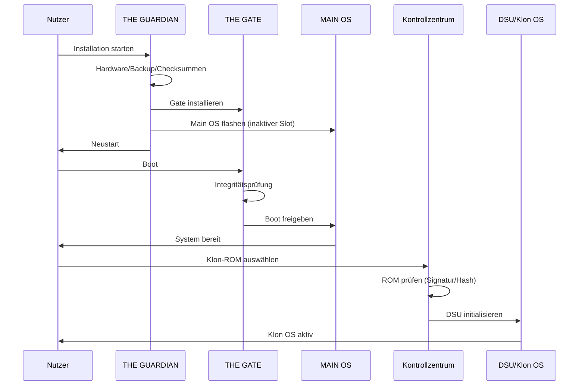

# Systemübersicht

AETHELGARD OS besteht aus klar getrennten Schichten, die zusammen eine sichere Installation,
verlässliche Boot-Validierung und eine isolierte Spielwiese für Custom ROMs ermöglichen.

## Komponenten und Aufgaben

- **THE GUARDIAN (L0):** Paranoider Installer mit Zustandsmaschine, Backup und atomarem A/B-Flash.
- **THE GATE (L1):** Boot-Wächter mit Integritätsprüfungen und Recovery-Entscheidungslogik.
- **MAIN OS (L2):** Unveränderliches Android-System mit OverlayFS-Schutz.
- **KLON OS (L3):** DSU-basierte Sandbox für Root/Custom ROMs.
- **KONTROLLZENTRUM (L4):** System-App zum Laden, Prüfen und Starten von Klon-ROMs.

## Interaktionsfluss (vereinfacht)

## Sicherheits- und Datenfluss-Highlights

- **Kein Brick:** Schreibvorgänge erfolgen nur im inaktiven Slot mit Verifikation.
- **Daten-Schutz:** OverlayFS isoliert Systemänderungen; Benutzerdateien bleiben getrennt.
- **Self-Healing:** Fehlgeschlagene Boots lösen Gate-Recovery oder Rollback aus.

## Erweiterbarkeit

Die Schichtenstruktur erlaubt es, neue Geräteprofile, ROM-Validierer oder Test-Tools
unabhängig einzubringen, ohne die Sicherheitsgrenzen zu verwässern.
