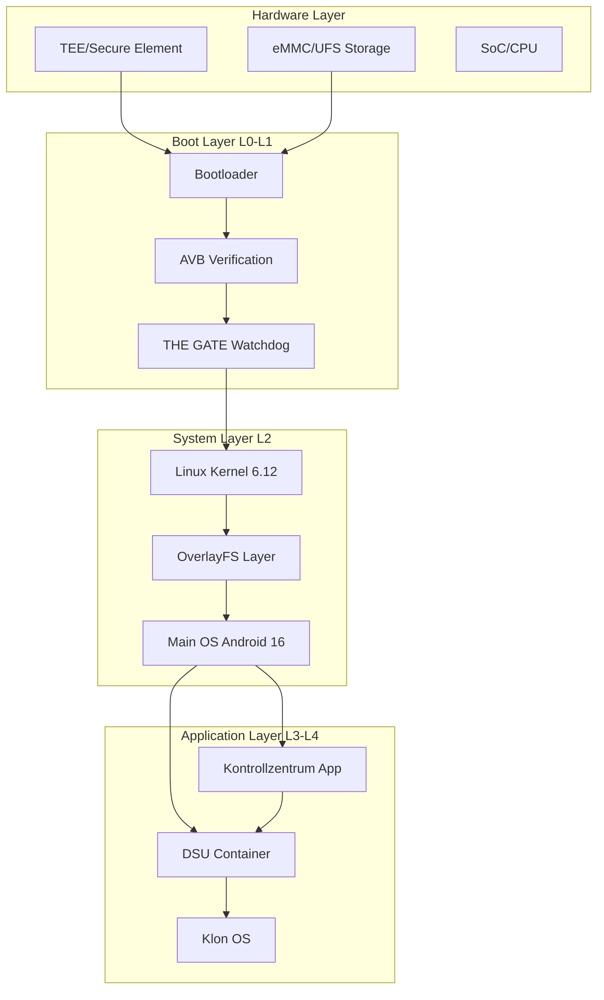
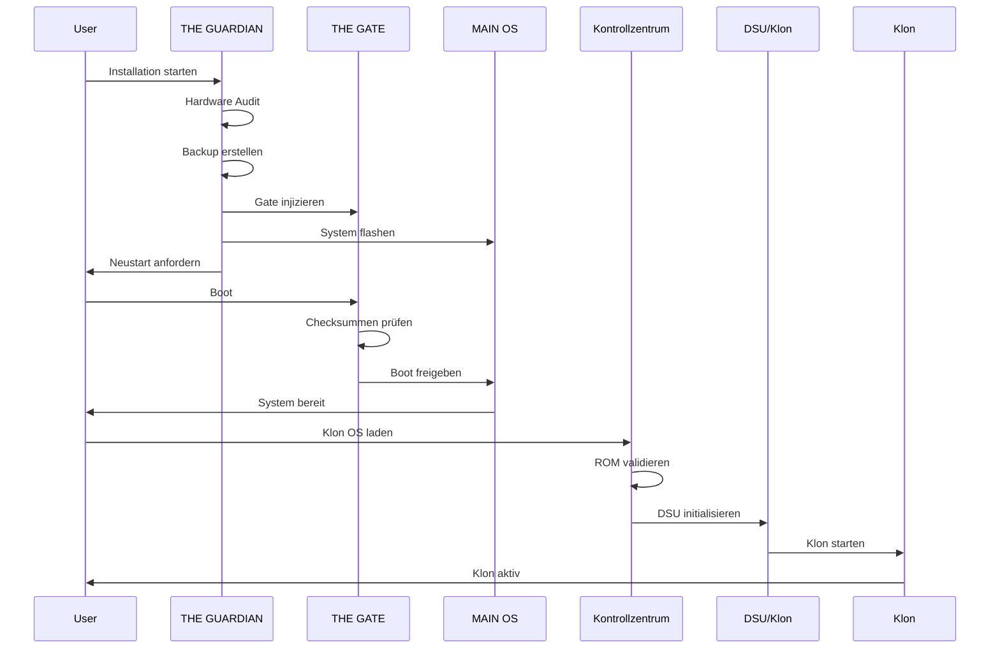
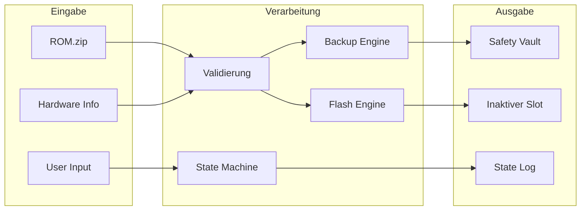
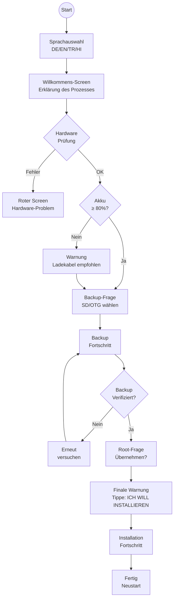
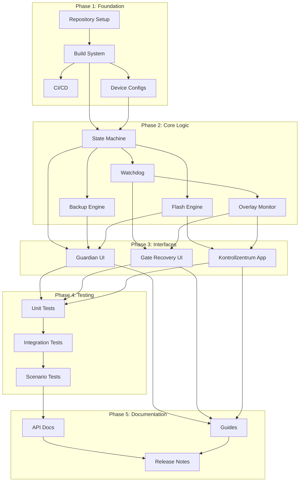
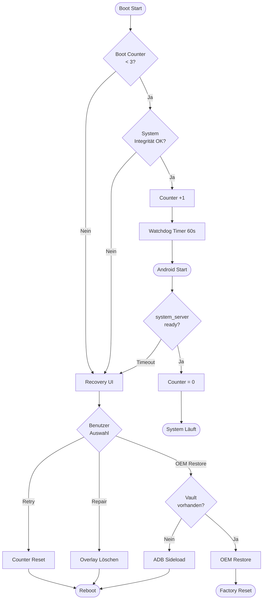

# Technical Specification

# 0. Agent Action Plan

## 0.1 Product Understanding


### 0.1.1 Kernprodukt-Vision

Basierend auf dem Prompt versteht die Blitzy-Plattform, dass das neue Produkt **AETHELGARD OS** ist - ein hochsicheres, selbstheilendes Android 16 (AOSP) Betriebssystem mit einem revolutionären Dual-World-Architektur-Konzept. Das System besteht aus vier Hauptkomponenten:

**Primäre Systemkomponenten:**

| Komponente | Bezeichnung | Zweck |
|------------|-------------|-------|
| L0 | THE GUARDIAN (Installer) | Paranoider C++ Binary-Installer mit Framebuffer-GUI für sichere Installation |
| L1 | THE GATE (Bootloader-Hook) | Intelligenter Boot-Wächter und Enhanced Recovery System |
| L2 | MAIN OS (Android 16 Core) | Unveränderliches Haupt-Betriebssystem mit OverlayFS-Schutz |
| L3 | KLON OS (Sandbox) | DSU-basiertes sekundäres System für Root und Custom ROMs |
| L4 | KONTROLLZENTRUM (System-App) | Verwaltungs-App für Klon-Systeme und System-Reparatur |

**Funktionale Anforderungen:**

- **ZERO-BRICK-GARANTIE:** Kein Schreibvorgang ohne atomares A/B-Slotting und verifizierte SHA-256 Checksummen
- **STATE-AWARE INSTALLATION:** Zustandsmaschine mit Power-Loss-Resume-Funktion
- **DATA SANCTUARY:** Absolute Trennung von Benutzerdaten durch OverlayFS (Copy-On-Write)
- **HARDWARE-ROOTED TRUST:** TEE (Trusted Execution Environment) und AVB (Android Verified Boot) Integration
- **ISOLIERTE SPIELWIESE:** DSU-Container für Root-Zugriff und Custom ROMs mit strikter Sandbox-Trennung

**Nicht-funktionale Anforderungen:**

- **Sicherheit:** SELinux Enforcing-Modus zwingend; dm-verity aktiv auf allen Partitionen
- **Performance:** Boot-Zeit unter 60 Sekunden für Watchdog-Validierung
- **Skalierbarkeit:** Unterstützung für mehrere Android-Versionen und verschiedene Geräte
- **Zuverlässigkeit:** Automatische Selbstheilung nach max. 3 fehlgeschlagenen Boot-Versuchen
- **Speicher:** Dynamische Partition-Allokation mit mindestens 10GB freiem Speicher für DSU

**Implizite Anforderungen basierend auf der Produktdomäne:**

- Kernel-Konfiguration mit `CONFIG_OVERLAY_FS=y` für OverlayFS-Unterstützung
- F2FS oder ext4 Dateisystem für /data Partition (DSU-Voraussetzung)
- Dynamic Partitions Support für Virtual A/B und DSU
- Hardware-Key-Storage über TEE für Verschlüsselung
- VBMETA Partition für Verified Boot Metadata

### 0.1.2 Benutzeranweisungen-Interpretation

**KRITISCHE Direktiven erfasst:**

**Sprach-Anforderungen:**
- Gesamte Dokumentation und UI-Texte in DEUTSCH
- Technisches Vokabular darf Englisch bleiben
- Installer-Sprachen: Deutsch, English, Türkçe, हिन्दी (Hindi)

**Technologie-Stack-Präferenzen:**
- Basis: Android 16 (AOSP) mit Linux Kernel 6.12
- Filesystem: OverlayFS für System-Snapshots, EROFS für Read-Only Partitionen
- Installer: C++ Binary mit libzip, minui (Framebuffer GUI), libsparse
- Backup-Verschlüsselung: AES-GCM oder Adiantum mit gerätegebundenen Schlüsseln

**Architektur-Muster (impliziert):**
- Virtual A/B Partitioning für nahtlose Updates
- DSU (Dynamic System Updates) für Klon-OS-Management
- OverlayFS mit tmpfs für selbstheilende Systemänderungen
- Atomares Slotting: Immer auf inaktiven Slot schreiben

**Integrations-Anforderungen:**
- Magisk/KernelSU Migration: Root-Status vom Vorgänger-System übernehmen
- AVB Custom Keys für Signatur-Chain
- TEE/Secure Element für Hardware-gebundene Schlüssel
- ADB/Fastboot-Kompatibilität für Notfall-Recovery

**Deployment-Zielspezifikationen:**
- Primäres Testgerät: Red Magic Tablet (High-End, A/B Partitionen)
- Unterstützung für verschiedene SoC-Revisionen und RAM-Typen
- Mindestens 80% Akku oder Ladekabel für Installation

**Benutzer-Beispiele (exakt beibehalten):**

User Example 1: "Also der INSTALLER soll so nervig/sicher sein, dass es keinem gelingt etwas kaputt zu machen, also auch während dem Backup du musst an Sachen denken, wie dumm einer sein kann"

User Example 2: "Mache es krass sicher!!! Main OS (KEIN CODE NUR ABLAUF ODER BIBLIOTHEKEN) soll sicher sein und die Installation auch (Installer)"

User Example 3: "Also ich möchte im Kontrollzentrum custom Roms laden können, diese sollen gebaut und erst überprüft werden und dann sollen sie funktionieren"

### 0.1.3 Produkt-Typ-Klassifikation

**Produkt-Kategorie:** Custom Android Operating System mit integriertem Installer und Management-Tooling

**Zielbenutzer und Anwendungsfälle:**

| Benutzertyp | Primärer Anwendungsfall | Sicherheitsbedürfnis |
|-------------|------------------------|---------------------|
| Power-User | Custom ROM Testing ohne Brick-Risiko | Hoch |
| Entwickler | Sichere Entwicklungsumgebung mit Root | Mittel-Hoch |
| Root-Enthusiasten | Magisk/Xposed Module ohne Hauptsystem-Gefährdung | Hoch |
| Einsteiger | Einfache, sichere Installation mit Schutz vor Fehlern | Sehr Hoch |

**Skalierungs-Erwartungen:**
- **Initial:** Produktionsreif für ausgewählte Geräte (Red Magic Tablet)
- **Expansion:** Multi-Device-Support durch Hardware-Fingerprinting
- **Langfristig:** OTA-fähiges Update-System via Kontrollzentrum-App

**Wartungs- und Evolutionsüberlegungen:**
- Modularer Aufbau ermöglicht unabhängige Updates der Komponenten
- Signatur-Chain erlaubt sichere Key-Rotation
- Snapshot-basierte Rollbacks für schnelle Wiederherstellung
- Telemetrie (opt-in) für Debugging und Verbesserungen


## 0.2 Background Research


### 0.2.1 Technologie-Forschung

**Web-Recherche durchgeführt zu:**

**Android 16 AOSP Aktueller Stand:**

Die stabile Version von Android 16 wurde am 10. Juni 2025 veröffentlicht und basiert auf Linux Kernel Version 6.12. Die Plattform führt signifikante Verbesserungen ein, darunter Material 3 Expressive Design-Sprache und erweiterte Virtualisierungsfunktionen. Das Android Virtualization Framework (AVF) wurde erweitert, um Linux-Anwendungen in einer virtuellen Maschine auszuführen, was für die AETHELGARD Klon-OS-Isolation relevant ist.

**Schlüssel-Features für AETHELGARD:**
- Hypervisor Tracing Updates für verbesserte Virtualisierung
- KeyMint Version 4.0 mit moduleHash für APEX-Verifizierung
- SELinux Macro zur Härtung von Kernel-Treibern
- Mobile Network Security Section in Safety Center

**DSU (Dynamic System Updates) Best Practices:**

Dynamic System Updates ermöglichen das Herunterladen und Testen eines Android-System-Images ohne Risiko für das aktuelle System. DSU erstellt eine Sandbox-Umgebung, in der ein neues System-Image (typischerweise GSI) installiert und on-the-fly gebootet werden kann.

**Technische Voraussetzungen für DSU:**
- Kernel: device-mapper-verity (dm-verity) aktiviert
- Dateisystem: /data Partition mit F2FS oder ext4
- Speicher: Mindestens 10GB freier Speicherplatz empfohlen
- SD-Karten-Unterstützung für Geräte mit begrenztem internem Speicher
- Dynamic Partitions Support zwingend erforderlich

**Android Verified Boot (AVB 2.0) Implementation:**

AVB stellt die Integrität der auf einem Gerät laufenden Software sicher. Der Prozess beginnt mit einem schreibgeschützten Teil der Firmware, der Code erst nach kryptographischer Verifizierung lädt. Die zentrale Datenstruktur ist die VBMeta-Struktur mit kryptographisch signierten Deskriptoren.

**AVB Boot-States für AETHELGARD:**
- **GREEN:** LOCKED State, Schlüssel nicht vom Benutzer gesetzt
- **YELLOW:** LOCKED State, Schlüssel vom Benutzer gesetzt (Custom Keys)
- **ORANGE:** UNLOCKED State

**Rollback Protection:** Counter in Secure Storage oder TEE verhindert Downgrade auf unsichere Builds.

### 0.2.2 Architektur-Muster-Forschung

**Virtual A/B Partitioning:**

Virtual A/B kombiniert die Vorteile von Seamless Updates mit minimalem Speicherverbrauch. Updates erfolgen nahtlos im Hintergrund und können bei Fehlern zurückgerollt werden.

**Device-Mapper Stack für /system:**
```
[Top]      dm-verity Device (Verifikation)
[Middle]   dm-linear Device (Dynamic Partition)
[Bottom]   Super Partition (Physisch)
```

**XOR Compression (Android 13+):** Reduziert Snapshot-Größe um 25-40% durch effiziente Differenzspeicherung.

**OverlayFS für Self-Healing:**

OverlayFS löst Debug-Szenarien durch automatisches Setup von Backing Storage für beschreibbare Dateisysteme als Upper Reference. Bei A/B-Geräten wird `/mnt/scratch/overlay` verwendet.

**Kernel-Anforderungen:**
- `CONFIG_OVERLAY_FS=y` zwingend
- Patch "overlayfs: override_creds=off option bypass creator_cred" für Kernel 4.4+
- xattr-Handling für Kernel 4.19+

**Relevante Architektur-Muster:**

| Muster | Anwendung in AETHELGARD | Vorteil |
|--------|------------------------|---------|
| Copy-on-Write (COW) | OverlayFS System-Änderungen | RAM-basierte temporäre Änderungen |
| Atomic Transactions | A/B Slot-Wechsel | Keine teilweisen Updates |
| State Machine | Installer mit Resume | Power-Loss-Resilienz |
| Watchdog Timer | Boot-Überwachung | Automatische Recovery |
| Sandbox Isolation | DSU Container | Sichere Klon-Trennung |

### 0.2.3 Abhängigkeits- und Tool-Forschung

**Aktuelle stabile Versionen der vorgeschlagenen Technologien:**

| Technologie | Version | Kompatibilität | Notizen |
|-------------|---------|----------------|---------|
| Android AOSP | 16 (API 36) | Zielplattform | Codename "Baklava" |
| Linux Kernel | 6.12 | Erforderlich | GKI Support |
| libavb | 2.0 | AVB Integration | libavb_cert für Zertifikate |
| minui | AOSP-Latest | Framebuffer GUI | Recovery-UI Basis |
| libsparse | AOSP-Latest | Image-Verarbeitung | Sparse Image Support |
| libzip | 1.10+ | ZIP-Handling | ROM-Extraktion |
| NDK | r26+ | C++ Compilation | für Installer Binary |

**Kompatibilitätsmatrix:**

```
┌─────────────────────────────────────────────────────────────┐
│                    AETHELGARD Kompatibilität                │
├─────────────────────────────────────────────────────────────┤
│ Komponente      │ Mindest   │ Empfohlen │ Getestet         │
├─────────────────────────────────────────────────────────────┤
│ Android Version │ 10 (Q)    │ 16        │ 14, 15, 16       │
│ Kernel Version  │ 4.9       │ 6.12      │ 5.4, 5.10, 6.1   │
│ Partition Type  │ A/B       │ Virtual AB│ Dynamic Part.    │
│ Bootloader      │ Unlocked  │ AVB 2.0   │ Fastboot Support │
│ Storage Type    │ eMMC      │ UFS 3.1   │ UFS 2.1+         │
└─────────────────────────────────────────────────────────────┘
```

**Entwicklungs-Tool-Empfehlungen:**

**Build-System:**
- Android.bp (Soong) für AOSP-Integration
- CMake/Ninja für Standalone-Binaries
- Gradle für Kotlin-basierte System-App

**Test-Framework:**
- CTS (Compatibility Test Suite) für Verifizierung
- VTS (Vendor Test Suite) für HAL-Kompatibilität
- ADB Shell Scripts für Power-Loss-Simulation

**CI/CD Pipeline-Muster:**
- Reproducible Builds für Binary-Authentizität
- Staged Rollouts: Canary → Beta → Stable
- Delta-Updates für effiziente OTA-Verteilung
- Air-Gapped Signing für Private Keys


## 0.3 Technical Architecture Design


### 0.3.1 Technologie-Stack-Auswahl

**Primäre Programmiersprache: C++ (C++17)**
- Rationale: Native Performance für Bootloader-nahe Operationen, direkte Kernel-Interaktion, keine Runtime-Dependencies

**Framework und Bibliotheken:**

| Bibliothek | Version | Rationale |
|------------|---------|-----------|
| libbase | AOSP | Android-native Logging und String-Utilities |
| libsparse | AOSP | Sparse Image Parsing für ROM-Verarbeitung |
| libzip | 1.10+ | ZIP/GZ/XZ Extraktion für ROM-Pakete |
| minui | AOSP | Framebuffer-basierte Touch-GUI für Recovery |
| libavb | 2.0 | Android Verified Boot Integration |
| libfstab | AOSP | Partition-Mounting und fstab-Parsing |
| libdiskconfig | AOSP | Partitions-Management |
| libcrypto | OpenSSL 3.x | SHA-256, AES-GCM Verschlüsselung |

**Sekundäre Sprachen:**
- **Kotlin** - Kontrollzentrum System-App (moderne Android-Entwicklung)
- **Rust** - Sicherheitskritische Module (Memory Safety)
- **Shell/Bash** - Build-Scripts und Test-Automatisierung

**Datenbank:** SQLite (Android-nativ) für Installer-State und App-Konfiguration

### 0.3.2 Architektur-Muster

**Gesamtarchitektur: Schichtenmodell mit Hardware-Trust-Anker**



**Begründung:** Die Schichtenarchitektur gewährleistet strikte Trennung zwischen Hardware-Trust, Boot-Validierung, System-Isolation und Benutzer-Interaktion. Jede Schicht kann nur mit der direkt angrenzenden kommunizieren.

**Komponenten-Interaktionsmodell:**



### 0.3.3 Datenfluss-Architektur

**Installer Datenfluss (THE GUARDIAN):**



### 0.3.4 Sicherheitsarchitektur

**Trust Chain:**

```
┌─────────────────────────────────────────────────────────────┐
│                    AETHELGARD Trust Chain                   │
├─────────────────────────────────────────────────────────────┤
│                                                             │
│  ┌─────────────┐    ┌─────────────┐    ┌─────────────┐     │
│  │ Hardware    │───>│ Bootloader  │───>│ vbmeta      │     │
│  │ Root of     │    │ (Locked)    │    │ Partition   │     │
│  │ Trust (TEE) │    │             │    │             │     │
│  └─────────────┘    └─────────────┘    └─────────────┘     │
│         │                  │                  │             │
│         v                  v                  v             │
│  ┌─────────────┐    ┌─────────────┐    ┌─────────────┐     │
│  │ Device Key  │───>│ AVB Keys    │───>│ Boot Image  │     │
│  │ (Secure     │    │ (Custom     │    │ Signature   │     │
│  │  Storage)   │    │  Enrolled)  │    │             │     │
│  └─────────────┘    └─────────────┘    └─────────────┘     │
│                                               │             │
│                                               v             │
│                          ┌─────────────────────────────┐   │
│                          │ THE GATE Watchdog           │   │
│                          │ (Checksummen Validierung)   │   │
│                          └─────────────────────────────┘   │
│                                               │             │
│                    ┌──────────────────────────┼─────┐      │
│                    v                          v     │      │
│            ┌─────────────┐            ┌─────────────┐      │
│            │ Main OS     │            │ Klon OS     │      │
│            │ (Immutable) │            │ (Sandboxed) │      │
│            └─────────────┘            └─────────────┘      │
│                                                             │
└─────────────────────────────────────────────────────────────┘
```

**Sicherheitsebenen:**

| Ebene | Mechanismus | Schutz gegen |
|-------|-------------|--------------|
| L0 Hardware | TEE Key Storage | Key Extraction |
| L1 Boot | AVB Signature Check | Manipulierte Images |
| L2 Partition | dm-verity | Laufzeit-Modifikation |
| L3 System | SELinux Enforcing | Privilege Escalation |
| L4 Overlay | OverlayFS COW | Permanente Beschädigung |
| L5 Sandbox | DSU Isolation | Klon-zu-Main Leakage |

### 0.3.5 Integrationspunkte

**Externe Services:**
- OTA Update Server (optional für Kontrollzentrum-Updates)
- GSI Repository für Custom ROM Downloads
- Telemetrie-Backend (opt-in) für Crash-Reporting

**API-Verträge:**

| API | Protokoll | Authentifizierung |
|-----|-----------|-------------------|
| DynamicSystem API | Binder IPC | MANAGE_DYNAMIC_SYSTEM Permission |
| boot_control HAL | HIDL/AIDL | System UID |
| libavb | Native C | Signature Verification |
| Kontrollzentrum ↔ Gate | Unix Socket | Root/System Permission |

**Datenaustausch-Formate:**
- JSON: Manifest-Dateien, Konfiguration, State-Logs
- Protobuf: OTA Payload, Update Metadata
- Binary: Raw Partition Images, Sparse Images


## 0.4 Repository Structure Planning


### 0.4.1 Vorgeschlagene Repository-Struktur

```
aethelgard/
├── guardian/                           # THE GUARDIAN Installer
│   ├── src/
│   │   ├── main.cpp                   # Installer Haupteinstiegspunkt
│   │   ├── state_machine/
│   │   │   ├── installer_state.h      # State Machine Definitionen
│   │   │   ├── installer_state.cpp    # State Machine Implementierung
│   │   │   └── resume_handler.cpp     # Power-Loss Resume Logik
│   │   ├── hardware/
│   │   │   ├── device_audit.cpp       # Hardware-Fingerprinting
│   │   │   ├── battery_check.cpp      # Akku- und Ladezustand
│   │   │   ├── storage_health.cpp     # eMMC/UFS Gesundheitsprüfung
│   │   │   └── thermal_monitor.cpp    # Temperaturüberwachung
│   │   ├── backup/
│   │   │   ├── vault_manager.cpp      # Transit-Backup Verwaltung
│   │   │   ├── hash_validator.cpp     # SHA-256 Verifizierung
│   │   │   ├── encryption.cpp         # AES-GCM Verschlüsselung
│   │   │   └── chunked_backup.cpp     # Unterbrechbares Backup
│   │   ├── flash/
│   │   │   ├── slot_manager.cpp       # A/B Slot Verwaltung
│   │   │   ├── atomic_writer.cpp      # Atomare Schreiboperationen
│   │   │   ├── sparse_handler.cpp     # Sparse Image Verarbeitung
│   │   │   └── partition_resize.cpp   # Dynamische Partitionsgrößen
│   │   ├── ui/
│   │   │   ├── framebuffer_ui.cpp     # minui Framebuffer GUI
│   │   │   ├── touch_handler.cpp      # Touch-Eingabe
│   │   │   ├── key_navigation.cpp     # Lautstärke-Tasten Fallback
│   │   │   ├── dialogs.cpp            # Warnungs-Dialoge
│   │   │   └── progress_bar.cpp       # Fortschrittsanzeige
│   │   ├── locale/
│   │   │   ├── de_DE.json             # Deutsche Texte
│   │   │   ├── en_US.json             # Englische Texte
│   │   │   ├── tr_TR.json             # Türkische Texte
│   │   │   └── hi_IN.json             # Hindi Texte
│   │   └── security/
│   │       ├── avb_handler.cpp        # AVB Key Management
│   │       ├── signature_verify.cpp   # Image Signatur-Prüfung
│   │       └── user_consent.cpp       # Semantische Eingabe-Validierung
│   ├── include/
│   │   └── guardian/                  # Public Headers
│   ├── Android.bp                     # AOSP Build Definition
│   └── CMakeLists.txt                 # Standalone Build
│
├── gate/                               # THE GATE Boot-Wächter
│   ├── src/
│   │   ├── gate_init.cpp              # Init-Process Hook
│   │   ├── watchdog/
│   │   │   ├── boot_counter.cpp       # Boot-Versuch Zähler
│   │   │   ├── crash_detector.cpp     # Crash/Panic Erkennung
│   │   │   └── auto_revert.cpp        # Automatischer Rollback
│   │   ├── integrity/
│   │   │   ├── checksum_verify.cpp    # Partition Checksummen
│   │   │   ├── overlay_monitor.cpp    # OverlayFS Überwachung
│   │   │   └── selinux_check.cpp      # SELinux Context Validierung
│   │   ├── recovery_ui/
│   │   │   ├── gate_ui.cpp            # Recovery Interface
│   │   │   ├── repair_menu.cpp        # Reparatur-Optionen
│   │   │   └── restore_menu.cpp       # OEM Restore Menu
│   │   └── config/
│   │       └── boot_config.cpp        # Boot-Konfiguration Parser
│   ├── init/
│   │   └── gate.rc                    # Init.rc Integration
│   └── Android.bp
│
├── mainos/                             # MAIN OS Anpassungen
│   ├── overlay/                       # System Overlays
│   │   ├── frameworks/
│   │   │   └── base/                  # Framework Patches
│   │   └── system/
│   │       └── sepolicy/              # SELinux Policies
│   ├── config/
│   │   ├── device_config.mk           # Geräte-Konfiguration
│   │   ├── security_config.xml        # Sicherheitseinstellungen
│   │   └── overlayfs_config.xml       # OverlayFS Konfiguration
│   └── scripts/
│       ├── build_mainos.sh            # Main OS Build Script
│       └── sign_images.sh             # Signatur-Script
│
├── kontrollzentrum/                    # KONTROLLZENTRUM App
│   ├── app/
│   │   ├── src/main/
│   │   │   ├── kotlin/com/aethelgard/command/
│   │   │   │   ├── AethelgardApp.kt           # Application Klasse
│   │   │   │   ├── MainActivity.kt            # Haupt-Activity
│   │   │   │   ├── ui/
│   │   │   │   │   ├── dashboard/             # Dashboard Fragment
│   │   │   │   │   ├── rommanager/            # ROM Gallery
│   │   │   │   │   ├── rules/                 # Regeln & Firewall
│   │   │   │   │   ├── vault/                 # Backup Verwaltung
│   │   │   │   │   └── advanced/              # Experten-Tools
│   │   │   │   ├── service/
│   │   │   │   │   ├── DsuService.kt          # DSU Management
│   │   │   │   │   ├── RomImportService.kt    # ROM Import/Convert
│   │   │   │   │   ├── RepairService.kt       # System-Reparatur
│   │   │   │   │   └── WatchdogService.kt     # Watchdog Kommunikation
│   │   │   │   ├── data/
│   │   │   │   │   ├── repository/            # Data Repositories
│   │   │   │   │   ├── model/                 # Data Models
│   │   │   │   │   └── database/              # Room Database
│   │   │   │   └── util/
│   │   │   │       ├── ShellExecutor.kt       # Root Shell Commands
│   │   │   │       ├── HashUtils.kt           # Checksum Utilities
│   │   │   │       └── PermissionUtils.kt     # Permission Handling
│   │   │   ├── res/
│   │   │   │   ├── layout/                    # UI Layouts
│   │   │   │   ├── values/                    # Strings (Multi-Lang)
│   │   │   │   ├── drawable/                  # Icons/Graphics
│   │   │   │   └── anim/                      # Animationen
│   │   │   └── AndroidManifest.xml
│   │   └── build.gradle.kts
│   ├── magisk_module/                  # Magisk Modul für System-App
│   │   ├── module.prop
│   │   ├── customize.sh
│   │   └── system/
│   └── build.gradle.kts
│
├── tools/                              # Build- und Test-Tools
│   ├── build/
│   │   ├── build_all.sh               # Kompletter Build
│   │   ├── build_installer.sh         # Nur Installer
│   │   ├── build_app.sh               # Nur App
│   │   └── create_release.sh          # Release-Paket erstellen
│   ├── signing/
│   │   ├── generate_keys.sh           # Schlüssel generieren
│   │   ├── sign_boot.sh               # Boot Image signieren
│   │   └── avb_config.json            # AVB Konfiguration
│   └── testing/
│       ├── power_loss_test.sh         # Stromausfall Simulation
│       ├── brick_test.sh              # Brick-Versuch Test
│       ├── bootloop_inject.sh         # Bootloop Injection
│       └── selinux_fuzzer.sh          # SELinux Policy Test
│
├── docs/                               # Dokumentation
│   ├── architecture/
│   │   ├── system_overview.md         # Systemübersicht
│   │   ├── security_model.md          # Sicherheitsmodell
│   │   └── data_flow.md               # Datenfluss-Diagramme
│   ├── guides/
│   │   ├── installation_guide.md      # Installationsanleitung
│   │   ├── developer_guide.md         # Entwicklerhandbuch
│   │   └── troubleshooting.md         # Fehlerbehebung
│   └── api/
│       ├── guardian_api.md            # Guardian API Docs
│       ├── gate_api.md                # Gate API Docs
│       └── kontrollzentrum_api.md     # App API Docs
│
├── config/                             # Globale Konfiguration
│   ├── devices/
│   │   ├── redmagic_pad.json          # Red Magic Tablet Profil
│   │   └── generic_ab.json            # Generisches A/B Profil
│   ├── security/
│   │   ├── selinux/                   # SELinux Policies
│   │   └── avb/                       # AVB Konfiguration
│   └── locale/
│       └── supported_languages.json   # Sprachunterstützung
│
├── .github/
│   └── workflows/
│       ├── build.yml                  # CI Build
│       ├── test.yml                   # Automatisierte Tests
│       └── release.yml                # Release Pipeline
│
├── LICENSE                             # GPL v3 Lizenz
├── README.md                           # Projekt-Dokumentation
├── CONTRIBUTING.md                     # Beitrags-Richtlinien
└── SECURITY.md                         # Sicherheits-Policy
```

### 0.4.2 Dateipfad-Spezifikationen

**Kern-Anwendungsdateien:**

| Pfad | Zweck | Priorität |
|------|-------|-----------|
| `guardian/src/main.cpp` | Installer Haupteinstiegspunkt | Kritisch |
| `guardian/src/state_machine/installer_state.cpp` | Zustandsmaschine mit Resume | Kritisch |
| `guardian/src/backup/vault_manager.cpp` | Verschlüsseltes Transit-Backup | Kritisch |
| `guardian/src/flash/atomic_writer.cpp` | Atomares A/B Flashing | Kritisch |
| `gate/src/gate_init.cpp` | Boot-Wächter Kernlogik | Kritisch |
| `gate/src/watchdog/boot_counter.cpp` | Bootloop-Erkennung | Hoch |
| `kontrollzentrum/app/src/.../DsuService.kt` | DSU API Integration | Hoch |
| `kontrollzentrum/app/src/.../RomImportService.kt` | ROM-Konvertierung | Hoch |

**Konfigurationsdateien:**

| Pfad | Zweck |
|------|-------|
| `config/devices/redmagic_pad.json` | Gerätespezifische Einstellungen |
| `guardian/src/locale/*.json` | Mehrsprachige UI-Texte |
| `mainos/config/overlayfs_config.xml` | OverlayFS Mount-Konfiguration |
| `config/security/avb/*` | AVB Schlüssel und Zertifikate |

**Einstiegspunkte:**

| Pfad | Typ | Beschreibung |
|------|-----|--------------|
| `guardian/src/main.cpp` | Binary | Installer-Einstieg für Recovery |
| `gate/src/gate_init.cpp` | Kernel-Modul | Früher Boot-Hook |
| `kontrollzentrum/app/.../MainActivity.kt` | Android Activity | App-Einstieg |
| `tools/build/build_all.sh` | Shell Script | Build-Automatisierung |


## 0.5 Implementation Specifications


### 0.5.1 Kernkomponenten und Module

**Komponente A: THE GUARDIAN (Installer)**

- **Zweck:** Paranoider, zustandsbewusster Installer mit Zero-Brick-Garantie
- **Speicherort:** `guardian/src/`
- **Sprache:** C++17
- **Schlüssel-Interfaces:**

```cpp
// Öffentliche Schnittstellen
class InstallerStateMachine {
    State getCurrentState();
    bool transition(State nextState);
    bool resumeFromPowerLoss();
};

class VaultManager {
    bool createBackup(const DeviceInfo& device);
    bool verifyBackup(const std::string& path);
    bool restoreFromBackup();
};

class AtomicFlasher {
    bool flashToInactiveSlot(const Image& img);
    bool verifyFlash(Slot target);
    bool switchActiveSlot();
};
```

**Komponente B: THE GATE (Boot-Wächter)**

- **Zweck:** Früher Boot-Hook für Integritätsprüfung und Recovery
- **Speicherort:** `gate/src/`
- **Sprache:** C++17/C
- **Abhängigkeiten:** libavb, libfstab, minui

```cpp
// Öffentliche Schnittstellen
class GateWatchdog {
    int getBootAttemptCount();
    bool checkSystemIntegrity();
    void triggerRecoveryMode();
    void resetBootCounter();
};

class OverlayMonitor {
    std::vector<FileChange> getChangedFiles();
    bool revertOverlayLayer();
    bool validateSELinuxContexts();
};
```

**Komponente C: KONTROLLZENTRUM (System-App)**

- **Zweck:** Verwaltungs-UI für Klon-OS und System-Reparatur
- **Speicherort:** `kontrollzentrum/app/src/`
- **Sprache:** Kotlin
- **Abhängigkeiten:** DynamicSystem API, KernelSU/Magisk

```kotlin
// Öffentliche Interfaces
interface DsuManager {
    suspend fun installGsi(gsiPath: Path): Result<Unit>
    suspend fun bootIntoGsi(): Result<Unit>
    suspend fun discardGsi(): Result<Unit>
    fun getInstalledGsi(): GsiInfo?
}

interface RomConverter {
    suspend fun convertToSparse(romZip: Path): Path
    suspend fun validateRom(romPath: Path): ValidationResult
    suspend fun injectRoot(romPath: Path): Path
}

interface SystemRepairer {
    suspend fun scanForCorruption(): List<CorruptedFile>
    suspend fun repairFile(file: CorruptedFile): Result<Unit>
    suspend fun revertToSnapshot(snapshotId: String): Result<Unit>
}
```

### 0.5.2 Datenmodelle und Schemata

**Installer State Schema (JSON):**

```json
{
  "$schema": "installer_state_v1",
  "version": "1.0.0",
  "state": {
    "current_phase": "BACKUP_IN_PROGRESS",
    "phase_progress": 45,
    "started_at": "2025-02-04T10:30:00Z",
    "last_checkpoint": "2025-02-04T10:35:00Z"
  },
  "device": {
    "hardware_id": "redmagic_pad_v1",
    "active_slot": "a",
    "battery_level": 85,
    "charging": true
  },
  "backup": {
    "vault_path": "/data/local/tmp/vault",
    "external_path": "/external_sd/SAFETY_BACKUP",
    "partitions_backed_up": ["boot_a", "dtbo_a"],
    "total_size_bytes": 2147483648,
    "verified": false
  },
  "checksums": {
    "boot_a": "sha256:abc123...",
    "system_a": "sha256:def456..."
  }
}
```

**Backup Manifest Schema (JSON):**

```json
{
  "$schema": "backup_manifest_v1",
  "created_at": "2025-02-04T10:30:00Z",
  "device_info": {
    "model": "Red Magic Pad",
    "soc": "Snapdragon 8 Gen 2",
    "android_version": "14",
    "security_patch": "2025-01-05"
  },
  "partitions": [
    {
      "name": "boot_a",
      "size_bytes": 67108864,
      "sha256": "abc123...",
      "encrypted": true
    }
  ],
  "encryption": {
    "algorithm": "AES-256-GCM",
    "key_derivation": "PBKDF2",
    "device_bound": true
  },
  "signature": "RSA-2048:xyz789..."
}
```

**ROM Gallery Datenmodell:**

```kotlin
@Entity(tableName = "installed_roms")
data class InstalledRom(
    @PrimaryKey val id: String,
    val name: String,
    val version: String,
    val androidVersion: Int,
    val securityPatchLevel: String,
    val imagePath: String,
    val sizeBytes: Long,
    val sha256: String,
    val isRooted: Boolean,
    val installedAt: Long,
    val lastBootedAt: Long?,
    val bootCount: Int,
    val persistenceMode: PersistenceMode
)

enum class PersistenceMode {
    GHOST,    // RAM-Disk, Änderungen gehen bei Reboot verloren
    ANCHOR    // Persistente Änderungen
}
```

### 0.5.3 API-Spezifikationen

**Guardian ↔ Gate Kommunikation (Unix Socket):**

| Endpoint | Methode | Request | Response |
|----------|---------|---------|----------|
| `/gate/status` | GET | - | `{ "healthy": bool, "boot_count": int }` |
| `/gate/revert` | POST | `{ "layer": "overlay" }` | `{ "success": bool }` |
| `/gate/unlock` | POST | `{ "passphrase": "..." }` | `{ "token": "..." }` |

**Kontrollzentrum REST-ähnliche Intents:**

| Action | Extra | Beschreibung |
|--------|-------|--------------|
| `com.aethelgard.BOOT_KLON` | `rom_id: String` | Startet spezifisches Klon-OS |
| `com.aethelgard.IMPORT_ROM` | `uri: Uri` | Importiert ROM aus Datei |
| `com.aethelgard.REPAIR_SYSTEM` | `mode: String` | Startet Reparaturmodus |
| `com.aethelgard.PANIC` | - | Notfall-Kill aller Klons |

**DynamicSystem API Wrapper:**

```kotlin
interface AethelgardDsuApi {
    // Requires MANAGE_DYNAMIC_SYSTEM permission
    @RequiresPermission("android.permission.MANAGE_DYNAMIC_SYSTEM")
    suspend fun startInstallation(
        gsiPath: String,
        userdataSize: Long,
        onProgress: (Int) -> Unit
    ): InstallationResult

    suspend fun isInstalled(): Boolean
    suspend fun remove(): Boolean
    suspend fun setBootSlot(useGsi: Boolean): Boolean
}
```

### 0.5.4 Benutzeroberflächen-Design

**Guardian Installer UI-Flow:**



**Kontrollzentrum Dashboard Design:**

```
┌─────────────────────────────────────────────────────────────┐
│  AETHELGARD COMMAND                           ⚙️  🌐  ⬛   │
├─────────────────────────────────────────────────────────────┤
│                                                             │
│  ┌─────────────────────────────────────────────────────┐   │
│  │  SYSTEM STATUS           [████████████] SICHER      │   │
│  │  Main OS: LOCKED    Overlay: INAKTIV    Boot: #1    │   │
│  └─────────────────────────────────────────────────────┘   │
│                                                             │
│  ┌────────────────┐  ┌────────────────┐  ┌──────────────┐  │
│  │ 📱 KLON-OS    │  │ 🛡️ REGELN     │  │ 📦 VAULT    │  │
│  │ LineageOS 22  │  │ Boot: 3x max   │  │ 4.2 GB      │  │
│  │ [STARTEN]     │  │ [BEARBEITEN]   │  │ [ÖFFNEN]    │  │
│  └────────────────┘  └────────────────┘  └──────────────┘  │
│                                                             │
│  ┌─────────────────────────────────────────────────────┐   │
│  │  ROM GALLERY                              [+ NEU]   │   │
│  │  ┌────────┐  ┌────────┐  ┌────────┐  ┌────────┐    │   │
│  │  │  LOS   │  │ Pixel  │  │ crdroid│  │ Xiaomi │    │   │
│  │  │  22.1  │  │ Exp.   │  │  10.8  │  │ EU.rom │    │   │
│  │  │ 🟢 OK  │  │ 🟡 Test│  │ 🔴 Err │  │ 🟢 OK  │    │   │
│  │  └────────┘  └────────┘  └────────┘  └────────┘    │   │
│  └─────────────────────────────────────────────────────┘   │
│                                                             │
│  [🏠 Dashboard] [🌐 Gateway] [⚙️ Regeln] [📦 Vault] [🔧]  │
└─────────────────────────────────────────────────────────────┘
```

### 0.5.5 Fehlerbehandlungs-Strategien

**Guardian Installer Fehlerszenarien:**

| Fehlertyp | Erkennung | Reaktion |
|-----------|-----------|----------|
| Stromausfall | State-Log inkonsistent | Resume von letztem Checkpoint |
| Speicher voll | Pre-Flight Check | Abbruch vor Schreiboperation |
| Korruptes Backup | Hash-Mismatch | Erneutes Backup erzwingen |
| Falsches Gerät | Hardware-ID Mismatch | Sofortiger Abbruch |
| Flash-Fehler | Schreib-/Lesefehler | Rollback auf Original-Slot |
| Akku kritisch | Level < 20% | Warnung, dann Pause |

**Gate Watchdog Logik:**

```cpp
// Pseudo-Code für Boot-Validierung
if (boot_attempt_count > MAX_ATTEMPTS) {
    trigger_recovery_ui();
    return RECOVERY_MODE;
}

if (!verify_system_integrity()) {
    if (user_confirms_revert()) {
        revert_overlay_layer();
    }
    return RECOVERY_MODE;
}

increment_boot_counter();
set_watchdog_timer(BOOT_TIMEOUT_SEC);
continue_android_boot();

// Nach erfolgreichem Boot (system_server ready)
reset_boot_counter();
cancel_watchdog_timer();
```


## 0.6 Scope Definition


### 0.6.1 Explizit im Scope

**Kernfunktionalität für MVP:**

**THE GUARDIAN Installer:**
- Hardware-Fingerprint-Scan mit Whitelist-Abgleich
- Akku-Hysterese-Check (min. 50% oder mit Ladekabel)
- Flash-Speicher Stresstest (Schreib-/Lese-Validierung)
- eMMC/UFS Life-Time-Estimate Abfrage
- Zwanghaftes Transit-Backup auf externe Speicher
- Bit-genaue Backup-Verifizierung mit SHA-256
- Verschlüsselung mit gerätegebundenem Schlüssel
- Power-Loss-Resume über State-Log
- Atomares A/B Slot-Flashing
- Root/Magisk Migration vom Vorgänger-System
- Mehrsprachige UI (DE, EN, TR, HI)
- Semantische Bestätigung ("ICH WILL INSTALLIEREN")
- Countdown vor Slot-Wechsel

**THE GATE Boot-Wächter:**
- Boot-Attempt Counter mit 3-Strike-Limit
- Checksum-Validierung vor System-Start
- Dirty-Shutdown-Erkennung
- OverlayFS Integritätsprüfung
- Automatischer Overlay-Revert bei Fehler
- Recovery-UI mit Touch und Key-Navigation
- OEM/Original-System Restore-Option
- Safe-Mode Boot (ohne OverlayFS)
- ADB Sideload Modus für Notfall

**MAIN OS Anpassungen:**
- OverlayFS für /system (Read-Only Lower, RAM Upper)
- EROFS für Read-Only Partitionen
- SELinux Enforcing (zwingend)
- dm-verity aktiv
- AVB Custom Key Integration
- Entwickler-Option für Kontrollzentrum-Aktivierung
- fs-verity für kritische Binaries
- Snapshot-Punkte vor System-Änderungen

**KONTROLLZENTRUM App:**
- Dashboard mit System-Status
- ROM-Import (ZIP, IMG, GZ, XZ)
- Automatische Sparse-Image-Konvertierung
- SPL/VNDK Kompatibilitätsprüfung
- DSU Installation und Management
- Root/Magisk Injection in Klon-Images
- Persistenz-Modi (Ghost/Anchor)
- Dual-Pane Dateimanager (Main ↔ Klon)
- Overlay-Log mit Diff-View
- One-Click Overlay Revert
- Backup-Export auf SD/OTG
- System-Reparatur gegen Master-Image

**Infrastruktur und Build:**
- AOSP-Integration mit Android.bp
- CMake für Standalone-Builds
- Gradle für Kotlin-App
- Reproducible Builds
- Signatur-Workflow mit Air-Gapped Keys
- CI/CD mit GitHub Actions

**Test-Abdeckung:**
- Power-Loss während Backup (10%, 50%, 99%)
- Korruptes ROM-Image (1-Bit-Flip)
- Bootloop-Injection und Recovery
- SELinux Policy Fuzzing
- Speicher-voll Szenario
- Falsches Gerät Installation

**Minimale Dokumentation:**
- README mit Quick-Start
- Installationsanleitung
- Architektur-Übersicht
- API-Dokumentation für Erweiterungen

### 0.6.2 Explizit außerhalb des Scopes

**Nicht für initiale Version erforderlich:**

**Produktions-Deployment-Automatisierung:**
- Cloud-basiertes OTA-Update-System
- Automatische Build-Verteilung
- Play Store Veröffentlichung
- Enterprise MDM Integration

**Umfassendes Monitoring und Logging:**
- Zentrales Telemetrie-Backend
- Real-time Crash-Reporting Dashboard
- Performance-Metriken-Sammlung
- Automatisierte Log-Analyse

**Performance-Optimierungen über Basisanforderungen hinaus:**
- Kernel-Level Tweaks für Gaming
- Custom Scheduler
- Memory Management Optimierungen
- GPU-spezifische Anpassungen

**Internationalisierung (über 4 Sprachen hinaus):**
- Arabisch (RTL Layout)
- Chinesisch
- Japanisch
- Weitere Sprachen

**Spezifische Ausschlüsse basierend auf User-Input:**

| Ausschluss | Begründung |
|------------|------------|
| Emulator-artiger Ansatz | User fordert DSU-basierte Lösung, keine Emulation |
| Online-Abhängigkeit | Installer muss komplett offline funktionieren |
| Bootloader-Entsperrung | Bootloader muss bereits entsperrt sein |
| OEM-Lock Manipulation | Keine Anleitung zum OEM-Unlock |
| Banking-App Umgehung | Keine Attestation-Spoofing Features |
| DRM-Umgehung | Keine Widevine/PlayReady Manipulation |

**Geräte-spezifische Ausschlüsse:**
- Samsung Knox-geschützte Geräte (kein Root möglich)
- Geräte ohne A/B Partitionen (Legacy)
- Geräte ohne Dynamic Partitions
- iOS/andere Plattformen

### 0.6.3 Scope-Grenzen und Abgrenzungen

**Grenzfälle mit klarer Definition:**

| Grenzfall | Entscheidung | Begründung |
|-----------|--------------|------------|
| Root im Main OS | Möglich, aber nicht empfohlen | User-Wahl bei Installation |
| Custom Kernel | Nicht unterstützt im Main OS | Kernel-Integrität für Sicherheit |
| Xposed Framework | Nur im Klon-OS | Systemmodifikation zu riskant |
| GApps Installation | Über Kontrollzentrum möglich | ROM-spezifisch |
| SafetyNet/Play Integrity | Kein Bypass, kein Spoofing | Ethische Richtlinie |

**Verantwortlichkeits-Abgrenzung:**

```
┌─────────────────────────────────────────────────────────────┐
│                    AETHELGARD Verantwortung                 │
├─────────────────────────────────────────────────────────────┤
│ ✓ Zero-Brick Installation                                   │
│ ✓ Main OS Integrität                                        │
│ ✓ Klon-OS Isolation                                         │
│ ✓ Backup-Validierung                                        │
│ ✓ Recovery bei System-Fehlern                               │
├─────────────────────────────────────────────────────────────┤
│                    NICHT AETHELGARD Verantwortung           │
├─────────────────────────────────────────────────────────────┤
│ ✗ Hardware-Defekte                                          │
│ ✗ OEM-Firmware-Bugs                                         │
│ ✗ Unsichere User-Aktionen im Klon-OS                        │
│ ✗ Drittanbieter-ROM Qualität                                │
│ ✗ Netzwerk-/Cloud-Dienste                                   │
└─────────────────────────────────────────────────────────────┘
```


## 0.7 Deliverable Mapping


### 0.7.1 Dateierstellungs-Plan

**Kritische Pfad-Dateien (Priorität: Kritisch):**

| Dateipfad | Zweck | Inhaltstyp |
|-----------|-------|------------|
| `guardian/src/main.cpp` | Installer-Einstiegspunkt und Initialisierung | Source |
| `guardian/src/state_machine/installer_state.cpp` | Zustandsmaschine mit Checkpoint-Logik | Source |
| `guardian/src/state_machine/resume_handler.cpp` | Power-Loss Recovery Implementierung | Source |
| `guardian/src/backup/vault_manager.cpp` | Transit-Backup Erstellung und Validierung | Source |
| `guardian/src/backup/hash_validator.cpp` | SHA-256 Checksummen-Berechnung | Source |
| `guardian/src/backup/encryption.cpp` | AES-GCM Verschlüsselung mit Geräteschlüssel | Source |
| `guardian/src/flash/atomic_writer.cpp` | Atomare Schreiboperationen auf Partitionen | Source |
| `guardian/src/flash/slot_manager.cpp` | A/B Slot Verwaltung und Wechsel | Source |
| `gate/src/gate_init.cpp` | Boot-Hook Kernlogik | Source |
| `gate/src/watchdog/boot_counter.cpp` | Boot-Versuch-Zähler mit Persistenz | Source |
| `gate/src/watchdog/auto_revert.cpp` | Automatischer Overlay-Rollback | Source |

**Hohe Priorität Dateien:**

| Dateipfad | Zweck | Inhaltstyp |
|-----------|-------|------------|
| `guardian/src/hardware/device_audit.cpp` | Hardware-Fingerprinting und Whitelist | Source |
| `guardian/src/hardware/battery_check.cpp` | Akku-Level und Ladestatus | Source |
| `guardian/src/hardware/storage_health.cpp` | Flash-Speicher Gesundheitsprüfung | Source |
| `guardian/src/ui/framebuffer_ui.cpp` | minui-basierte Touch-GUI | Source |
| `guardian/src/ui/dialogs.cpp` | Warnungs- und Bestätigungs-Dialoge | Source |
| `guardian/src/locale/de_DE.json` | Deutsche Sprachdateien | Config |
| `guardian/src/locale/en_US.json` | Englische Sprachdateien | Config |
| `guardian/src/locale/tr_TR.json` | Türkische Sprachdateien | Config |
| `guardian/src/locale/hi_IN.json` | Hindi Sprachdateien | Config |
| `gate/src/recovery_ui/gate_ui.cpp` | Recovery-Interface Implementierung | Source |
| `gate/src/recovery_ui/repair_menu.cpp` | Reparatur-Optionen Menü | Source |
| `kontrollzentrum/app/.../DsuService.kt` | DSU API Wrapper Service | Source |
| `kontrollzentrum/app/.../RomImportService.kt` | ROM-Import und Konvertierung | Source |
| `kontrollzentrum/app/.../MainActivity.kt` | Haupt-Activity mit Navigation | Source |

**Mittlere Priorität Dateien:**

| Dateipfad | Zweck | Inhaltstyp |
|-----------|-------|------------|
| `guardian/src/security/avb_handler.cpp` | AVB Key Management | Source |
| `guardian/src/security/signature_verify.cpp` | Image-Signatur Validierung | Source |
| `guardian/src/security/user_consent.cpp` | Semantische Bestätigungslogik | Source |
| `gate/src/integrity/checksum_verify.cpp` | Partition-Checksummen Prüfung | Source |
| `gate/src/integrity/selinux_check.cpp` | SELinux Context Validierung | Source |
| `kontrollzentrum/app/.../ui/dashboard/*` | Dashboard UI Komponenten | Source |
| `kontrollzentrum/app/.../ui/rommanager/*` | ROM Gallery Komponenten | Source |
| `kontrollzentrum/app/.../RepairService.kt` | System-Reparatur Service | Source |
| `mainos/overlay/system/sepolicy/*` | SELinux Policy Erweiterungen | Config |
| `config/devices/redmagic_pad.json` | Red Magic Tablet Profil | Config |

**Test-Dateien:**

| Dateipfad | Testzweck | Inhaltstyp |
|-----------|-----------|------------|
| `tools/testing/power_loss_test.sh` | Stromausfall-Simulation bei 10/50/99% | Test |
| `tools/testing/brick_test.sh` | Versuch System zu bricken | Test |
| `tools/testing/bootloop_inject.sh` | Bootloop durch Dateikorruption | Test |
| `tools/testing/selinux_fuzzer.sh` | SELinux Policy Violation Tests | Test |
| `guardian/tests/unit/state_machine_test.cpp` | Unit Tests für State Machine | Test |
| `guardian/tests/unit/hash_validator_test.cpp` | Unit Tests für Hash Validierung | Test |
| `kontrollzentrum/app/src/test/*` | Kotlin Unit Tests | Test |
| `kontrollzentrum/app/src/androidTest/*` | Android Instrumentation Tests | Test |

**Dokumentations-Dateien:**

| Dateipfad | Dokumentiert | Inhaltstyp |
|-----------|--------------|------------|
| `README.md` | Projekt-Übersicht und Quick-Start | Documentation |
| `docs/guides/installation_guide.md` | Schritt-für-Schritt Installation | Documentation |
| `docs/architecture/system_overview.md` | Architektur-Diagramme | Documentation |
| `docs/architecture/security_model.md` | Sicherheitskonzept | Documentation |
| `docs/api/guardian_api.md` | Guardian API Referenz | Documentation |
| `docs/api/gate_api.md` | Gate API Referenz | Documentation |
| `docs/api/kontrollzentrum_api.md` | Kontrollzentrum Intents/Services | Documentation |
| `docs/guides/troubleshooting.md` | Fehlerbehebung | Documentation |

### 0.7.2 Implementierungs-Phasen

**Phase 1: Foundation (Kern-Struktur und Konfiguration)**

```
Deliverables:
├── Repository-Struktur
├── Build-System Setup (Android.bp, CMake, Gradle)
├── CI/CD Pipeline Grundkonfiguration
├── Geräte-Konfigurationsprofile
├── Signatur-Schlüssel Generierung
└── Basis-Dokumentation (README, CONTRIBUTING)
```

**Phase 2: Core Logic (Primäre Geschäftslogik und Datenmodelle)**

```
Deliverables:
├── guardian/
│   ├── State Machine Implementierung
│   ├── Hardware Audit Module
│   ├── Backup Engine (Vault Manager, Encryption)
│   └── Atomic Flash Engine
├── gate/
│   ├── Boot Counter und Watchdog
│   ├── Checksum Verification
│   └── Overlay Monitor
└── Datenmodelle und JSON Schemata
```

**Phase 3: Interfaces (APIs, CLIs, UIs)**

```
Deliverables:
├── guardian/
│   ├── Framebuffer UI mit minui
│   ├── Touch und Key Navigation
│   ├── Mehrsprachige Dialoge
│   └── Progress Visualization
├── gate/
│   ├── Recovery UI
│   ├── Repair Menu
│   └── Restore Menu
└── kontrollzentrum/
    ├── Dashboard Fragment
    ├── ROM Manager Fragment
    ├── Rules Fragment
    ├── Vault Fragment
    └── Advanced Tools Fragment
```

**Phase 4: Testing (Unit- und Integrationstests)**

```
Deliverables:
├── Unit Tests für alle Module
├── Integration Tests für Workflows
├── Automatisierte Szenario-Tests
│   ├── Power-Loss Simulation
│   ├── Brick-Versuch Tests
│   ├── Bootloop Recovery Tests
│   └── SELinux Fuzzing
└── Test-Dokumentation und Coverage-Reports
```

**Phase 5: Documentation (README und Guides)**

```
Deliverables:
├── Vollständige API-Dokumentation
├── Installationsanleitung (Multi-Sprache)
├── Entwicklerhandbuch
├── Architektur-Dokumentation
├── Troubleshooting Guide
└── Release Notes Template
```

### 0.7.3 Abhängigkeits-Graph




## 0.8 References


### 0.8.1 Benutzer-bereitgestellte Ressourcen

**Keine Datei-Anhänge wurden für dieses Projekt bereitgestellt.**

Der Benutzer hat umfangreiche Anforderungen und KI-Konversations-Protokolle direkt im Prompt geliefert, die als primäre Informationsquelle dienen.

### 0.8.2 Technische Referenz-URLs

**Vom Benutzer explizit spezifizierte URLs:**

| URL | Beschreibung | Verwendungszweck |
|-----|--------------|------------------|
| https://developer.android.com/topic/performance/dsu | Android DSU Dokumentation | **PRIMÄRE REFERENZ** für Klon-OS Implementation via Dynamic System Updates |
| https://source.android.com/docs/core/architecture/bootloader/partitions/virtual-ab | Virtual A/B Partitioning | Referenz für atomares A/B Slotting und Slot-Management |
| https://source.android.com/docs/security/features/verifiedboot | Android Verified Boot (AVB) | Referenz für Boot-Signatur-Validierung und Trust Chain |
| https://source.android.com/docs/core/virtualization | Android Virtualization Framework | Optionale Referenz für pVM-basierte Isolation |

### 0.8.3 Web-Recherche Quellen

**Android 16 Plattform-Informationen:**

Die Recherche zu Android 16 (Codename "Baklava") ergab, dass die stabile Version am 10. Juni 2025 veröffentlicht wurde und auf Linux Kernel 6.12 basiert. Relevante Features umfassen erweiterte Virtualisierungsfunktionen und KeyMint Version 4.0.

**OverlayFS Kernel-Dokumentation:**

OverlayFS löst Debug-Szenarien durch automatisches Setup von Backing Storage. Für A/B-Geräte wird `/mnt/scratch/overlay` verwendet. Kernel-Konfiguration erfordert `CONFIG_OVERLAY_FS=y`.

**DSU Technische Anforderungen:**

Dynamic System Updates ermöglichen das Herunterladen und Testen eines Android-System-Images ohne Risiko. Voraussetzungen: device-mapper-verity aktiviert, F2FS/ext4 Dateisystem, mindestens 10GB freier Speicher.

**AVB Boot-States:**

Android Verified Boot definiert drei States: GREEN (LOCKED, OEM-Keys), YELLOW (LOCKED, Custom Keys), ORANGE (UNLOCKED). Rollback Protection über Secure Storage Counter.

### 0.8.4 Benutzer-Input Zusammenfassung

**Primäre Anforderungsquellen aus dem Prompt:**

| Quelle | Inhalt | Relevanz |
|--------|--------|----------|
| System Prompt "BlitzyAI" | Definition der AETHELGARD-Mission und 5 eiserne Gesetze | Kernarchitektur-Prinzipien |
| KI-Konversation #1 | Verbesserungen zu Sicherheit, UX, Testplan | Technische Verfeinerungen |
| KI-Konversation #2 | DSU-Konzept, Kontrollzentrum-Features | Klon-OS Management |
| KI-Konversation #3 | Installer-Sicherheit, Backup-Zwang | Guardian-Spezifikationen |
| KI-Konversation #4 | Gate als Boot-Interface, Recovery-Modi | Boot-Watchdog Design |
| KI-Konversation #5 | 107 Feature-Spezifikationen | Vollständige Feature-Liste |
| Mermaid-Graphen | Ablaufdiagramme für Installer und System | Prozess-Visualisierung |

**Explizit genannte Benutzer-Zitate (exakt beibehalten):**

- "Also der INSTALLER soll so nervig/sicher sein, dass es keinem gelingt etwas kaputt zu machen"
- "Mache es krass sicher!!! Main OS (KEIN CODE NUR ABLAUF ODER BIBLIOTHEKEN) soll sicher sein"
- "Also ich möchte im Kontrollzentrum custom Roms laden können, diese sollen gebaut und erst überprüft werden"
- "Das Gate und das Kontrollzentrum sind zwei verschiedene Dinge"
- "Es soll IMMER und ÜBERALL funktionieren"

### 0.8.5 AOSP und Standard-Referenzen

**Offizielle Android-Dokumentation:**

| Thema | Quelle |
|-------|--------|
| AOSP Build System | source.android.com/docs/setup |
| SELinux for Android | source.android.com/docs/security/selinux |
| HAL Interface Definition | source.android.com/docs/core/architecture |
| Recovery Mode | source.android.com/docs/core/ota/recovery |
| boot_control HAL | source.android.com/docs/core/architecture/bootloader |

**Relevante AOSP-Repositories:**

| Repository | Verwendung |
|------------|------------|
| `platform/bootable/recovery` | Basis für Gate Recovery UI |
| `platform/system/update_engine` | Referenz für Atomic Updates |
| `platform/system/gsid` | DSU Implementation |
| `platform/external/avb` | libavb Integration |


## 0.9 Execution Patterns


### 0.9.1 Implementierungs-Richtlinien

**C++ Richtlinien (Guardian, Gate):**

- **Standard:** C++17 mit AOSP-kompatiblen Flags
- **Namenskonventionen:**
  - Klassen: `PascalCase` (z.B. `VaultManager`)
  - Funktionen: `snake_case` (z.B. `verify_backup()`)
  - Konstanten: `UPPER_SNAKE_CASE` (z.B. `MAX_BOOT_ATTEMPTS`)
  - Member-Variablen: `m_` Präfix (z.B. `m_state`)
- **Error Handling:** Ausnahmebasiert mit try-catch, RAII für Ressourcen
- **Logging:** `libbase` LOG Makros (ALOG, LOG_INFO, LOG_ERROR)
- **Memory Safety:** Smart Pointers bevorzugen, keine raw `new/delete`

```cpp
// Beispiel: Korrekte Fehlerbehandlung
bool VaultManager::createBackup() {
    try {
        auto backup = std::make_unique<Backup>(m_device_info);
        if (!backup->write(m_vault_path)) {
            LOG(ERROR) << "Backup fehlgeschlagen";
            return false;
        }
        return verify_hash(backup->getHash());
    } catch (const std::exception& e) {
        LOG(ERROR) << "Exception: " << e.what();
        rollback_partial_backup();
        return false;
    }
}
```

**Kotlin Richtlinien (Kontrollzentrum):**

- **Standard:** Kotlin 1.9+ mit Android Gradle Plugin 8.x
- **Architektur:** MVVM mit Repository Pattern
- **Coroutines:** Für alle asynchronen Operationen
- **Dependency Injection:** Hilt/Dagger
- **Null Safety:** Strikte Null-Checks, kein `!!` ohne Validierung

```kotlin
// Beispiel: Service-Implementierung
class DsuServiceImpl @Inject constructor(
    private val context: Context
) : DsuService {
    override suspend fun installGsi(path: Path) = withContext(Dispatchers.IO) {
        // Implementation
    }
}
```

**Shell Script Richtlinien (Build, Test):**

- Shebang: `#!/bin/bash` mit `set -euo pipefail`
- Alle Variablen quoten: `"$VARIABLE"`
- Funktionen für wiederverwendbare Logik
- Kommentare für komplexe Befehle

### 0.9.2 Sicherheits-Best-Practices

**Kryptographie:**

| Anwendung | Algorithmus | Key-Länge |
|-----------|-------------|-----------|
| Backup-Verschlüsselung | AES-256-GCM | 256-bit |
| Image-Signaturen | RSA-PSS | 4096-bit |
| Hash-Validierung | SHA-256 | 256-bit |
| Key-Derivation | PBKDF2-HMAC-SHA256 | 100k Iterationen |

**Input-Validierung:**

```
┌─────────────────────────────────────────────────────────────────┐
│                AETHELGARD Input Validation Rules                │
├─────────────────────────────────────────────────────────────────┤
│ NIEMALS vertrauen:                                              │
│   - User-Eingaben im Installer                                  │
│   - Dateinamen aus ZIP-Archiven                                 │
│   - Metadaten aus ROM-Images                                    │
│   - Externe Speicher-Pfade                                      │
├─────────────────────────────────────────────────────────────────┤
│ IMMER validieren:                                               │
│   - Hardware-ID gegen Whitelist                                 │
│   - SHA-256 Checksummen vor/nach Schreiben                      │
│   - Dateisystem-Grenzen (kein Path Traversal)                   │
│   - Speicherplatz vor Operation                                 │
│   - Akku-Level vor kritischen Schritten                         │
└─────────────────────────────────────────────────────────────────┘
```

**SELinux Policy:**

- Alle neuen Domains mit minimal notwendigen Permissions
- Keine `permissive` Domains in Production
- `neverallow` Rules für kritische Grenzen
- Separate Contexts für Guardian, Gate, Kontrollzentrum

### 0.9.3 Qualitäts-Standards

**Code-Qualität:**

| Metrik | Zielwert | Werkzeug |
|--------|----------|----------|
| C++ Style | Google C++ Style | clang-format |
| Kotlin Style | Kotlin Official | ktlint |
| Test Coverage (Core) | ≥ 80% | gcov, JaCoCo |
| Static Analysis | 0 Critical Issues | clang-tidy, detekt |
| Documentation | Alle Public APIs | Doxygen, KDoc |

**Code Review Checkliste:**

- [ ] Alle öffentlichen Interfaces dokumentiert
- [ ] Error Handling für alle Fehlerpfade
- [ ] Keine hardcodierten Pfade oder Magic Numbers
- [ ] Logging an kritischen Punkten
- [ ] Unit Tests für neue Funktionalität
- [ ] SELinux Contexts korrekt definiert
- [ ] Kein Memory Leak (Valgrind/LeakCanary clean)

### 0.9.4 Fehlerbehandlungs-Muster

**Hierarchische Fehlerbehandlung:**

```
┌─────────────────────────────────────────────────────────────────┐
│                    AETHELGARD Error Hierarchy                   │
├─────────────────────────────────────────────────────────────────┤
│                                                                 │
│  Level 1: KRITISCH (Sofortiger Abbruch)                        │
│    - Hardware-ID Mismatch                                       │
│    - Signatur-Validierung fehlgeschlagen                        │
│    - Verschlüsselungs-Fehler                                    │
│    → Aktion: Abbruch, Rollback, Roter Screen                   │
│                                                                 │
│  Level 2: SCHWER (Benutzer-Entscheidung erforderlich)          │
│    - Backup-Verifizierung fehlgeschlagen                        │
│    - Speicherplatz knapp                                        │
│    - Akku niedrig ohne Ladekabel                                │
│    → Aktion: Warnung, Optionen anbieten, warten                │
│                                                                 │
│  Level 3: WARNUNG (Fortsetzung möglich)                        │
│    - Nicht-kritische Datei fehlt                                │
│    - Optionale Komponente nicht verfügbar                       │
│    - Performance-Degradation erkannt                            │
│    → Aktion: Log, Benachrichtigung, weitermachen               │
│                                                                 │
│  Level 4: INFO (Nur Logging)                                   │
│    - Erwartete Zustände                                         │
│    - Checkpoint erreicht                                        │
│    - Operation erfolgreich                                      │
│    → Aktion: Nur Log-Eintrag                                   │
│                                                                 │
└─────────────────────────────────────────────────────────────────┘
```

**Fail-Safe Prinzipien:**

- Bei Unsicherheit immer in den sichersten Zustand zurückfallen
- Read-Only mounten wenn Schreibfehler auftreten
- Reboot to Recovery wenn System-Integrität fraglich
- Niemals Daten löschen ohne verifiziertes Backup
- Immer User informieren bevor kritische Aktion

### 0.9.5 Test-Strategie

**Automatisierte Test-Szenarien:**

| Test-ID | Szenario | Erwartetes Ergebnis |
|---------|----------|---------------------|
| PWR-001 | Stromausfall bei 10% Backup | Resume von Checkpoint |
| PWR-002 | Stromausfall bei 50% Flash | Slot-Wechsel verhindert |
| PWR-003 | Stromausfall bei 99% Flash | Verifizierung beim Reboot |
| BRK-001 | /system/bin/sh löschen im Main OS | Overlay-Whiteout, Reboot heilt |
| BRK-002 | boot Partition korrupieren | Gate blockiert, Recovery UI |
| BRK-003 | Falsches Gerät flashen | Sofortiger Abbruch |
| DSU-001 | Klon-OS Bootloop | Auto-Revert nach 3 Versuchen |
| DSU-002 | Klon-OS Root-Escape Versuch | Sandbox-Isolation hält |
| SEC-001 | SELinux Policy Violation | Denial logged, Operation verhindert |

**Manuelle Test-Checkliste (vor Release):**

- [ ] Vollständige Installation auf Zielgerät
- [ ] Backup auf SD-Karte erstellen und verifizieren
- [ ] Backup auf OTG-USB erstellen und verifizieren
- [ ] Reboot in Main OS erfolgreich
- [ ] Klon-OS über Kontrollzentrum laden
- [ ] Klon-OS booten und Root verifizieren
- [ ] Datei-Bridge zwischen Main und Klon testen
- [ ] Overlay-Revert testen
- [ ] OEM-Restore vollständig durchführen
- [ ] Alle 4 Sprachen in Installer testen

### 0.9.6 Rollback- und Recovery-Strategien

**Installer Rollback-Matrix:**

| Phase | Rollback-Strategie | Dauer |
|-------|--------------------| ------|
| Pre-Backup | Sofortiger Exit, keine Änderungen | < 1s |
| Backup in Progress | Partial Backup löschen, Exit | < 5s |
| Post-Backup, Pre-Flash | Backup behalten, Exit | < 1s |
| Flash in Progress | Inaktiver Slot verwerfen, Original-Slot aktiv | < 10s |
| Post-Flash, Pre-Verify | Slot-Flag nicht setzen, Reboot zu Original | < 5s |
| Verify Failed | Inaktiver Slot markieren als invalid | < 2s |

**Gate Recovery-Entscheidungsbaum:**




